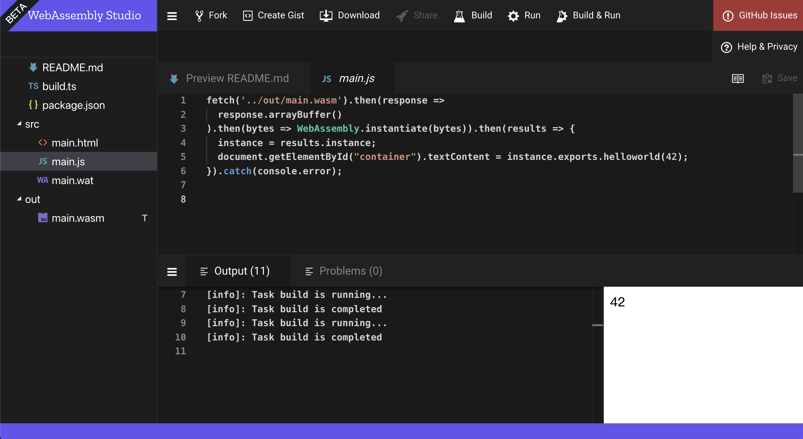
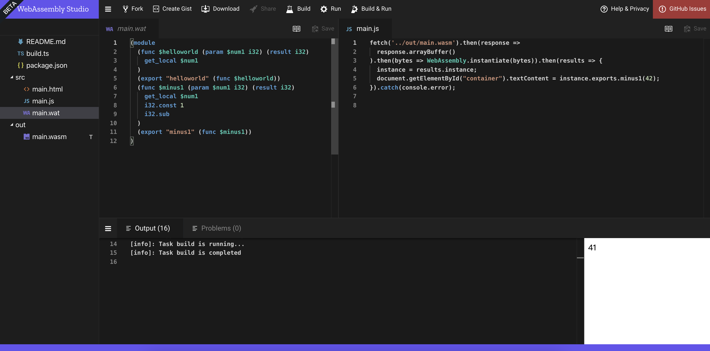

This is my note for [Web Assembly Course](https://frontendmasters.com/courses/web-assembly/) taught by [Jem Young](https://twitter.com/JemYoung) at FrontendMaster.

And here is the [Course Notes](https://young.github.io/intro-to-web-assembly/).

## What is Web Assembly?

Web Assembly (wasm) is a powerful low-level language that is meant to be a compile target for high-level languages. It is designed to be portable and ran in many different environments. It is designed to compliment JavaScript, not replace it.

Web Assembly runs in its own environment at near native speed, can be cached, and runs much faster than JavaScript can be parsed.

### File types

`.wasm` is the actual assembly code in binary format</br>
`.wat` is the human readable textual representation of the code

### Hello World Example

Use [Web Assembly Studio](https://webassembly.studio/) to write the example.

```wasm
;; main.wat
(module
  (func $helloworld (param $num1 i32) (result i32)
    get_local $num1
  )
  (export "helloworld" (func $helloworld))
)
```



## Stack and OpCode in Web Assembly

### Stacks

A stack is memory region where variables are stored and accessed by the running program. Once execution is complete the stack is cleared.

Web Assembly is stack based language so all operations read and write to the stack in a linear fashion.

### OpCodes

Opcodes (Operation Code) are readable computer instructions representing machine language instructions.

[Here is an interactive table](https://pengowray.github.io/wasm-ops/) of current Web Assembly OpCodes.

### Subtraction Example



## What is AssemblyScript?

[AssemblyScript](https://www.assemblyscript.org/introduction.html) at high level is a TypeScript to WebAssembly compiler. It provides both high-level language features such loops but also allows for low-level memory access.

### AssemblyScript Setup

Follow the [Quick Start Guide](https://www.assemblyscript.org/quick-start.html) of The AssemblyScript Book.

### Writing AssemblyScript

```js
// assembly/index.ts

export function minusOne(n: i32): i32 {
  return n - 1
}
```

run `$ npm run asbuild`

### Loading AssemblyScript - NodeJS

run `node`

```js
> const { minusOne } = require("./index.js")
> minusOne(2)

// 1
```

### Loading AssemblyScript - Browser

`Safari` doesn't support `WebAssembly.instantiateStreaming`, so we need a fallback method.

```js
// js/loader.js

class WasmLoader {
  constructor() {}

  async wasm(path) {
    console.log(`Fetching ${path}`)

    if (!WebAssembly.instantiateStreaming) {
      return this.wasmFallback(path)
    }

    const { instance } = await WebAssembly.instantiateStreaming(fetch(path))

    return instance?.exports
  }

  async wasmFallback(path) {
    console.log(`Using fallback ${path}`)

    const response = await fetch(path)
    const bytes = await response?.arrayBuffer()
    const { instance } = await WebAssembly.instantiate(bytes)

    return instance?.exports
  }
}
```

Serve the static files with simple express server.

Note that the response header of wasm file should be set to `application/wasm`.

And `express` will do that for us automatically.

```js
const express = require("express")
const app = express()

app.use(express.static("./"))

app.listen(3000, () => console.log("Server is running at port 3000"))
```

Loading in the browser.

```html
<!DOCTYPE html>
<html lang="en">
  <head>
    <meta charset="UTF-8" />
    <meta http-equiv="X-UA-Compatible" content="IE=edge" />
    <meta name="viewport" content="width=device-width, initial-scale=1.0" />
    <title>Document</title>
  </head>
  <body>
    <script src="/js/loader.js"></script>
    <script>
      const WL = new WasmLoader()
      WL.wasm("/build/optimized.wasm").then(instance => {
        const { minusOne } = instance

        document.write(minusOne(44))
      })
    </script>
  </body>
</html>
```

Navigate to `localhost:3000` and you will see 43 on the page.

### Imports

Just as we can export wasm functions, we can import JS functions into our code. One useful import is the `abort()` function which we call if we want terminate execution of wasm a function.

Call `abort()` if the function input is 44.

```js
// assembly/index.ts

export function minusOne(n: i32): i32 {
  if (n == 44) {
    abort()
  }

  return n - 1
}
```

Create an import object with an `abort()` function and pass it into the second argument of `instantiateStreaming()` and `instantiate()`.

```js
// js/loader.js

class WasmLoader {
  constructor() {
    this._imports = {
      env: {
        abort() {
          throw new Error("Abort called from wasm file")
        },
      },
    }
  }

  // ...
}
```

```diff
// js/loader.js

class WasmLoader {
  constructor() {
    // ...
  }

- async wasm(path) {
+ async wasm(path, imports = this._imports) {
    console.log(`Fetching ${path}`)

    if (!WebAssembly.instantiateStreaming) {
-     return this.wasmFallback(path)
+     return this.wasmFallback(path, imports)
    }

-   const { instance } = await WebAssembly.instantiateStreaming(fetch(path))
+   const { instance } = await WebAssembly.instantiateStreaming(
+     fetch(path),
+     imports
+   )

    return instance?.exports
  }

- async wasmFallback(path) {
+ async wasmFallback(path, imports) {
    console.log(`Using fallback ${path}`)

    const response = await fetch(path)
    const bytes = await response?.arrayBuffer()
-   const { instance } = await WebAssembly.instantiate(bytes)
+   const { instance } = await WebAssembly.instantiate(bytes, imports)

    return instance?.exports
  }
}
```

Open `localhost:3000` again and you will see an `Abort called from wasm file` error was thrown.

### AssemblyScript Loader

Because string is the high level programming language thing and Web Assembly doesn't not support it. The string will be stored in the memory with integer format. We will get the pointer if we read the string directly. So, use AssemblyScript Loader to deal with it.

Add the script tag to `index.html`.

```html
<script src="https://cdn.jsdelivr.net/npm/@assemblyscript/loader/umd/index.js"></script>
```

Replace browser built-in WebAssembly with AssemblyScript Loader.

```diff
class WasmLoader {
  constructor() {
    // ...
  }

  async wasm(path, imports = this._imports) {
    console.log(`Fetching ${path}`)

-   if (!WebAssembly.instantiateStreaming) {
+   if (!loader.instantiateStreaming) {
      return this.wasmFallback(path, imports)
    }

-   const { instance } = await WebAssembly.instantiateStreaming(fetch(path), imports)
+   const instance = await loader.instantiateStreaming(fetch(path), imports)

    return instance?.exports
  }

  async wasmFallback(path, imports) {
    console.log(`Using fallback ${path}`)

    const response = await fetch(path)
    const bytes = await response?.arrayBuffer()
-   const { instance } = await WebAssembly.instantiate(bytes, imports)
+   const instance = await loader.instantiate(bytes, imports)

    return instance?.exports
  }
}

```

Add the `--exportRuntime` into `asbuild` script.

```json
// package.json

{
  // ...
  "scripts": {
    // ...
    "asbuild:untouched": "asc assembly/index.ts --target debug --exportRuntime",
    "asbuild:optimized": "asc assembly/index.ts --target release --exportRuntime",
  },
  // ...
```

### Memory

```ts
// assembly/index.ts

// Grow memory by 2 pages (128Kb)
memory.grow(2)
// Save 21 at index 0
store<u8>(0, 21)
// Save 99 at index 1
store<u8>(1, 99)

export function readMemory(n: i32): i32 {
  return load<u8>(n)
}
```

```js
// index.html

const { readMemory, memory } = instance

const memoryArray = new Uint8Array(memory.buffer)
// Read from memory at index 1
// Returns 99
document.write(memoryArray[1])
document.write("<br />")
// Write to memory at index 2
memoryArray[2] = 42
// Returns 42
document.write(readMemory(2))
```

## JS vs Web Assembly vs Web Worker

Use **JavaScript** when you need to deal with strings, objects, giant arrays or complicated data structures. The abstractions, garbage collection and not having to allocate memory makes working in JavaScript much simpler.

Use **Wasm** when you need to write directly to memory applications or heavy computations. For example, image decoding or video decoding which manipulates bytes directly.

Use **Web Worker** when you need to do complex calculations involving objects or complicated data structures.

Wasm can be fetched and instantiated then cached into memory on the browser. A web worker, you can't do that. It inherently has a high memory cost and a high startup time. And the only way to communicate with a web worker is to use post message. And post message is an inefficient way of communicating between threads because it takes the data you're trying to pass and serializes that. Then it gets to deserialize. It keeps doing that back and forth.

[Good post to read](https://blog.logrocket.com/the-introductory-guide-to-assemblyscript/) for comparing JS and Wasm.
