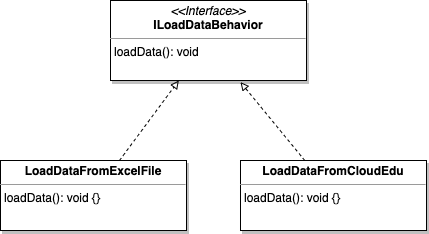
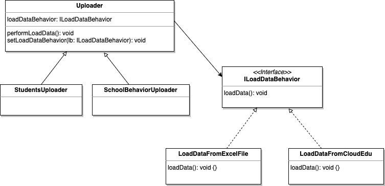

This is my notes for Chapter 1 of [Head First Design Pattern, 2nd Edition](https://learning.oreilly.com/library/view/head-first-design/9781492077992/).

And where can this pattern be applied in my daily work?

## What is the Strategy Pattern?

The Strategy Pattern defines a family of algorithms, encapsulates each one, and makes them interchangeable. Strategy lets the algorithm vary independently from clients that use it.

## Book's Example in TypeScript

The book's example is written in Java. So I rewrite it in [TypeScript](https://github.com/wtlin1228/typescript-head-first-design-patterns-2nd-edition/tree/main/01-duck).

## A Real Case in my Daily Work

There are different uploaders. For instance, `StudentsUploader` and `SchoolBehaviorUploader`.

- `StudentsUploader` can load the students' data for a new class from [cloud.edu](https://cloud.edu.tw/).
- `SchoolBehaviorUploader` can load the students' behavior data from a excel file or [cloud.edu](https://cloud.edu.tw/).

### Design the Uploader Behavior

Based on the design principle: Program to an interface, not an implementation. I use an interface to represent the load data behavior. Then implement each concrete behavior.



```ts
interface ILoadDataBehavior {
  loadData(): void
}

class LoadDataFromExcelFile implements ILoadDataBehavior {
  loadData(): void {
    console.log("load data from an excel file")
  }
}

class LoadDataFromCloudEdu implements ILoadDataBehavior {
  loadData(): void {
    console.log("load data from cloud.edu")
  }
}
```

### Integrate the Uploader Behavior

Key: A `Uploader` will delegate it's loading data behavior instead of using the loading data method defined in the `Uploader` class (or subclass).

First I add the instance variable of type `ILoadDataBehavior`. Each concrete uploader object will assign to this variable a specific loading data behavior at runtime.

```ts
abstract class Uploader {
  constructor(private loadDataBehavior: ILoadDataBehavior) {}

  performLoadData(): void {
    this.loadDataBehavior.loadData()
  }

  setLoadDataBehavior(lb: ILoadDataBehavior): void {
    this.loadDataBehavior = lb
  }
}

class StudentsUploader extends Uploader {
  constructor() {
    super(new LoadDataFromCloudEdu())
  }
}

class SchoolBehaviorUploader extends Uploader {
  constructor() {
    super(new LoadDataFromExcelFile())
  }
}
```

### Setting behavior dynamically

This pattern give me the ability to change the load data behavior at runtime. I can load school behavior data from an excel file first. Then Switch to load data from Cloud Edu.

```ts
const schoolBehaviorUploader = new SchoolBehaviorUploader()

schoolBehaviorUploader.performLoadData()
// load data from an excel file

const loadDataFromCloudEdu = new LoadDataFromCloudEdu()
schoolBehaviorUploader.setLoadDataBehavior(loadDataFromCloudEdu)

schoolBehaviorUploader.performLoadData()
// load data from cloud.edu
```

### The Big Picture



Think of each set of behaviors as a family of algorithms. And they are interchangeable.

In my case, load data behaviors is a set of algorithms. And clients can change the algorithm during the runtime.
