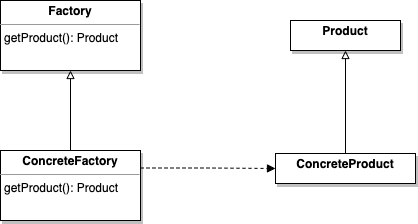
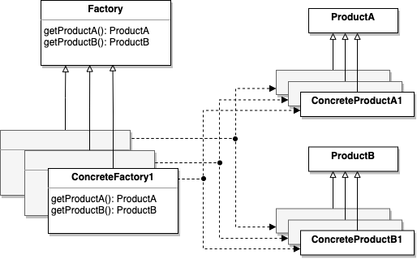
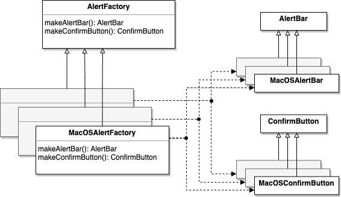

This is my note for Chapter 4 of [Head First Design Pattern, 2nd Edition](https://learning.oreilly.com/library/view/head-first-design/9781492077992/).

And where can this pattern be applied in my daily work?

## What is the Factory Pattern?

There are two patterns in this chapter.

1. Factory Method: Define an interface for creating an object, but let subclasses decide which class to instantiate. Factory Method lets a class defer instantiation to subclasses.

2. Abstract Factory: Provide an interface for creating families of related or dependent objects without specifying their concrete classes.

The main difference between them is that Factory Method only creates one object but Abstract Factory creates several objects.

### Diagrams

Thanks for the diagrams. We can see clearly that the Factory Method is actually a subset of the Abstract Factory when the factory only produces one product.

1. Factory Method

   

2. Abstract Factory

   

## Book's Example in TypeScript

The book's example is written in Java. So I rewrite it in [TypeScript](https://github.com/wtlin1228/typescript-head-first-design-patterns-2nd-edition/tree/main/04-pizza-store).

## A Real Case in my Daily Work

I want to design an alert component. This component contains two parts. One is the alert bar. The other one is the confirm button. And this alert component should be different in different OS (macOS, Windows, Linux).



### Design the Alert Bar

```js
abstract class AlertBar {}

class MacOSAlertBar extends AlertBar {}
class WindowsAlertBar extends AlertBar {}
class LinuxAlertBar extends AlertBar {}
```

### Design the Confirm Button

```js
abstract class ConfirmButton {}

class MacOSConfirmButton extends ConfirmButton {}
class WindowsConfirmButton extends ConfirmButton {}
class LinuxConfirmButton extends ConfirmButton {}
```

### Design the Alert Factory

Here are the rules. So lets use the Abstract Factory to help us follow these rules.

- `MacOSAlertBar` should be used with `MacOSConfirmButton`.
- `WindowsAlertBar` should be used with `WindowsConfirmButton`.
- `LinuxAlertBar` should be used with `LinuxConfirmButton`.

```js
abstract class AlertFactory {
  abstract makeAlertBar(): AlertBar
  abstract makeConfirmButton(): ConfirmButton
}

class MacOSAlertFactory extends AlertFactory {
  makeAlertBar(): AlertBar {
    return new MacOSAlertBar()
  }
  makeConfirmButton(): ConfirmButton {
    return new MacOSConfirmButton()
  }
}

class WindowsAlertFactory extends AlertFactory {
  makeAlertBar(): AlertBar {
    return new WindowsAlertBar()
  }
  makeConfirmButton(): ConfirmButton {
    return new WindowsConfirmButton()
  }
}

class LinuxAlertFactory extends AlertFactory {
  makeAlertBar(): AlertBar {
    return new LinuxAlertBar()
  }
  makeConfirmButton(): ConfirmButton {
    return new LinuxConfirmButton()
  }
}
```

### Usage

Client will receive a factory. And use this factory to make a combo of alert bar and confirm button. In this way, the client won't combine a `MacOSAlertBar` with a `LinuxConfirmButton` anymore.

```js
class Client {
  constructor(alertFactory: AlertFactory) {
    this.alertFactory = alertFactory
  }

  makeAlert(): void {
    const alertBar = this.alertFactory.makeAlertBar()
    const confirmButton = this.alertFactory.makeConfirmButton()

    // logics for making the alert component with alertBar and confirmButton
  }
}
```
