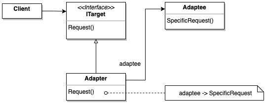
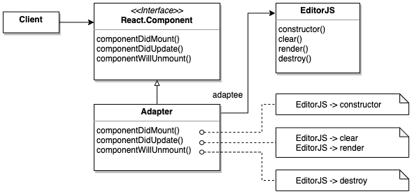

This is my notes for Chapter 7 of [Head First Design Pattern, 2nd Edition](https://learning.oreilly.com/library/view/head-first-design/9781492077992/).

And where can this pattern be applied in my daily work?

## What is the Adapter Pattern?

Convert the interface of a class into another interface clients expect. Adapter lets classes work together that couldn't otherwise because of incompatible interfaces.



## Book's Example in TypeScript

The book's example is written in Java. So I rewrite it in [TypeScript](https://github.com/wtlin1228/typescript-head-first-design-patterns-2nd-edition/tree/main/07-1-duck-and-turkey).

## A Real Case in my Daily Work

[Editor.js](https://editorjs.io/) is a next generation block styled editor. And I want to wrap it into a react component. Therefore, `<EditorJs />` can be used as a normal react component everywhere in my react project.

```js
const Foo = () => {
  return (
    <div>
      <h1>Let's try Editor.js</h1>
      <EditorJs />
    </div>
  )
}
```

### Interface of Editor.js

- constructor: create a new EditorJS instance
- clear: removes all Blocks and creates new empty initial Block
- render: creates UI of inserting Block
- destroy: clear heap occupied by Editor and remove UI components from the DOM

### Adapt Editor.js to React Component

- `componentDidMount()` -> `new EditorJS()`
- `componentDidUpdate()` -> `clear()` and `render()`
- `componentWillUnmount()` -> `destroy()`

### UML Diagram



### Real Implementation

Check [react-editor-js](https://github.com/Jungwoo-An/react-editor-js) to look into the details of the implementation of the editor.js component for React.
