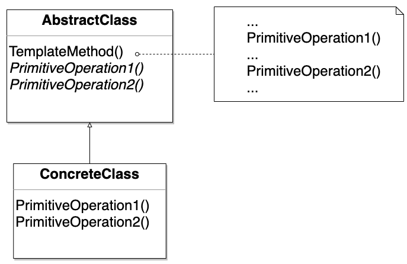
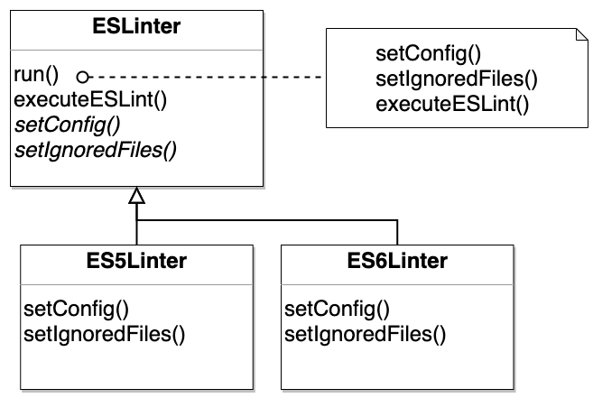

This is my notes for Chapter 8 of [Head First Design Pattern, 2nd Edition](https://learning.oreilly.com/library/view/head-first-design/9781492077992/).

And where can this pattern be applied in my daily work?

## What is the Template Method Pattern?

Define a skeleton of an algorithm in an operation, deferring some steps to subclasses. Template Method lets subclasses redefine certain steps of an algorithm without changing the algorithm's structure.



## Book's Example in TypeScript

The book's example is written in Java. So I rewrite it in [TypeScript](https://github.com/wtlin1228/typescript-head-first-design-patterns-2nd-edition/tree/main/08-caffeine).

## A Real Case in my Daily Work

Implement an abstract class `ESLinter` and two concrete classes `ES5Linter` and `ES6Linter`. That's because we need two different linters when we are migrating a codebase from ES5 to ES6.

```
.
├── path1
│   ├── file1.js (ES5)
│   ├── file2.js (ES5)
│   └── file3.js (ES6, use `ES6Linter`)
├── path2
│   ├── file1.js (ES6, use `ES6Linter`)
│   ├── file2.js (ES5)
│   └── file3.js (ES5)
└── ...
```

### Abstract Class `ESLinter`

`ESLinter.run()` is the template method.

```js
abstract class ESLinter {
  private config!: String
  private ignoredFiles!: String

  run(): void {
    this.setConfig()
    this.setIgnoredFiles()
    this.executeESLint()
  }

  abstract setConfig(): void
  abstract setIgnoredFiles(): void

  executeESLint(): void {
    // execute ESLint with this.config and this.ignoredFiles
  }
}
```

### Concrete Classes `ES5Linter` and `ES6Linter`

`ES5Linter` and `ES6Linter` should implement the primitive operations: `setConfig()` and `setIgnoredFiles()`.

```js
class ES5Linter extends ESLinter {
  setConfig(): void {
    // this.config = ...
  }

  setIgnoredFiles(): void {
    // this.ignoredFiles = ...
  }
}

class ES6Linter extends ESLinter {
  setConfig(): void {
    // this.config = ...
  }

  setIgnoredFiles(): void {
    // this.ignoredFiles = ...
  }
}
```

### Use `ES5linter` and `ES6Linter`

```js
const es5linter = new ES5Linter()
const es6linter = new ES6Linter()

es5linter.run() // only lint ES5 files with ES5 rules
es6linter.run() // only lint ES6 files with ES6 rules
```

### UML Diagram


