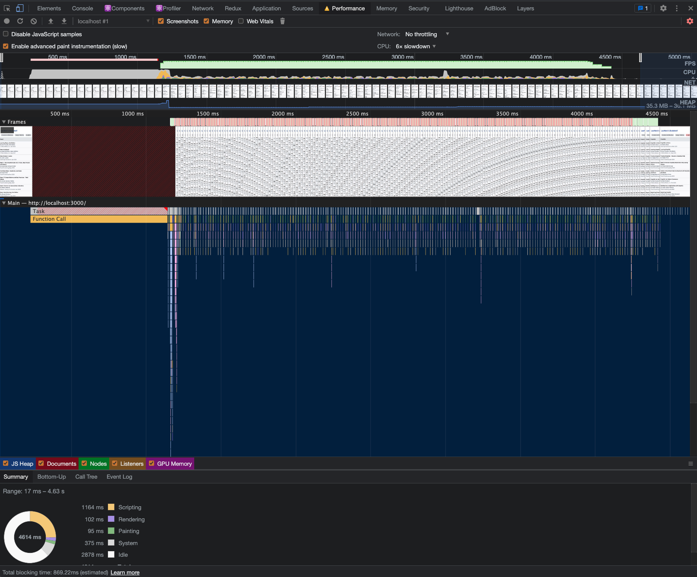
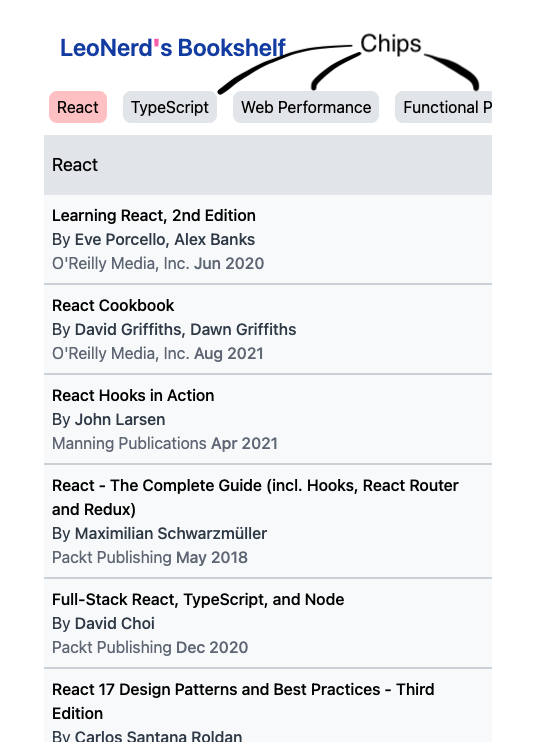

Performance is User Experience. So this post will show how to create a performant menu without using existing libraries (except for RxJS).

Below is the performance recording under 6x slowdown CPU (with 8 categories and each category has 10 items).



## Specifications

1. Activate the corresponding chip user is browsing.
1. Scroll the activated chip to the first place.
1. Scroll to the corresponding book category when clicking it's chip.
1. Activate the last chip when scrolling down to the bottom not by clicking a chip.
1. Activate the clicked chip when scrolling down to the bottom by clicking a chip.



## Intersection Observer

Use intersection observer instead of using scroll event listener to avoid too many works being done in the main thread.

For example, create a custom `useMenuCategoryInView` hook to observe whether a category is in viewport or not:

```js
export default function useMenuCategoryInView({ callback }) {
  const ref = useRef(null)

  useEffect(() => {
    const observer = new IntersectionObserver(
      ([entry]) => {
        if (entry.isIntersecting) {
          callback()
        }
      },
      { threshold: 0 }
    )

    const target = ref.current
    if (target) {
      observer.observe(target)
    }
    return () => {
      if (target) {
        observer.unobserve(target)
      }
    }
  }, [callback])

  return { ref }
}
```

You can find complete code for `useMenuCategoryInView` in [here](https://github.com/wtlin1228/menu-with-anchor/blob/main/src/hooks/useMenuCategoryInView.ts).

## RxJS

It can cause unnecessary rerenders if using state to manage those **in view categories**. With observables, we can defer the computation and provide a way to subscribe to. Therefore, use RxJS to transform those **menu category is in view** notifications into an observable stream. In this way, components can easily subscribe and unsubscribe to this stream then do whatever they need by operators.

For example, create a `CategoryInViewManagerProvider` manager to manage a RxJS subject:

```js
export const CategoryInViewManagerProvider = ({ children }) => {
  const forceRerenderFnRef = useRef<>(() => {})

  const subject = useMemo(() => {
    return new Subject()
  }, [])

  const handleCategoryInView = useCallback(
    (categoryId) => {
      subject.next(categoryId)
    },
    [subject]
  )

  const manager = useMemo(
    () => ({
      handleCategoryInView,
      topCategory$: subject,
    }),
    [
      handleCategoryInView,
      subject,
    ]
  )

  return (
    <CategoryInViewManagerContext.Provider value={manager}>
      {children}
    </CategoryInViewManagerContext.Provider>
  )
}
```

You can find complete code for `CategoryInViewManagerProvider` in [here](https://github.com/wtlin1228/menu-with-anchor/blob/main/src/managers/CategoryInViewManager.tsx).

## requestAnimationFrame

Use `requestAnimationFrame` to implement the animation for scrolling. This method tells the browser that you wish to perform an animation and requests that the browser calls a specified function to update an animation before the next repaint. The method takes a callback as an argument to be invoked before the repaint.

For example, create a `scrollWindowVerticallyTo` utility to handle scrolling window to a anchor:

```js
import { withDefaultOptions } from "./withDefaultOptions"
import type { IOptions } from "./withDefaultOptions"

export const scrollWindowVerticallyTo = (scrollToElement, options) => {
  // calculate how many pixels need to be scroll
  const initialVerticalScroll = window.scrollY
  const targetVerticalScroll =
    window.scrollY +
    scrollToElement.getBoundingClientRect().top +
    options.verticalOffset
  const verticalDistanceToScroll = targetVerticalScroll - initialVerticalScroll

  // calculate how much time this scroll animation will take
  let duration = Math.abs(
    Math.round((verticalDistanceToScroll / 1000) * options.speed)
  )

  // start the scroll animation
  return new Promise((resolve, reject) => {
    if (verticalDistanceToScroll === 0) {
      resolve(true)
    }

    let requestID

    const startingTime = Date.now()

    const step = () => {
      const timeDiff = Date.now() - startingTime
      const t = timeDiff / duration

      const verticalScrollPosition = Math.round(
        initialVerticalScroll + verticalDistanceToScroll * options.easing(t)
      )

      if (
        timeDiff < duration &&
        verticalScrollPosition !== targetVerticalScroll
      ) {
        elementToScroll.scrollTo(0, verticalScrollPosition)
        requestID = requestAnimationFrame(step)
      } else {
        elementToScroll.scrollTo(0, targetVerticalScroll)
        cancelAnimationFrame(requestID)
        resolve(true)
      }
    }

    requestID = requestAnimationFrame(step)
  })
}
```

You can find complete code for `scrollWindowVerticallyTo` in [here](https://github.com/wtlin1228/menu-with-anchor/blob/main/src/utils/scrollWindowVerticallyTo.ts).

## The Complete Code

The complete source code is in this github repository - https://github.com/wtlin1228/menu-with-anchor. Feel free to clone it then record the performance yourself.

## Reference

- [Intersection Observer API](https://developer.mozilla.org/en-US/docs/Web/API/Intersection_Observer_API)
- [RxJS - Subject](https://rxjs.dev/api/index/class/Subject)
- [Window.requestAnimationFrame()](https://developer.mozilla.org/en-US/docs/Web/API/window/requestAnimationFrame)
- [Stanko/animated-scroll-to](https://github.com/Stanko/animated-scroll-to)
