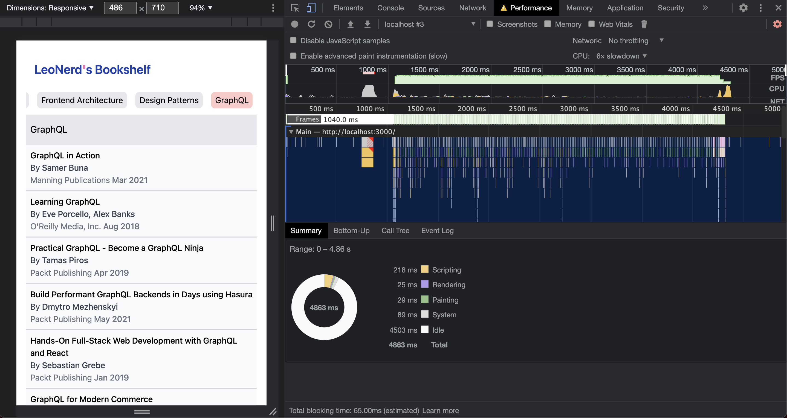
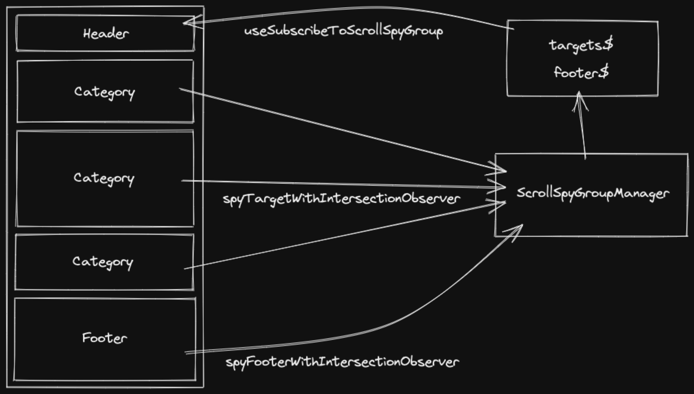

Performance is User Experience. So this post will show how I create a performant menu.


Below is the performance recording for my menu under 6x slowdown CPU (with 8 categories and each category has 10 items). You can see there are no dropping frames when I scroll through all the 80-items long menu.



## Context

I want to build a menu with some anchors attached to it. Those anchors help users scroll to exact category they are looking for. And I want to give users an overview of where they are, what is the current category they are watching.

In order to accomplish my goal. I know that I need to make something that can listen to the scroll event. Find a way to share the current category information through the app. And build a mechanism to prevent unnecessary renders.

Oh, one last thing to say. I also want to activate the last anchor chip when users scroll to the bottom.

## Technology Overview

Here are the primary technologies used in this project:

- [React](https://reactjs.org/): For the UI
- [Create React App](https://create-react-app.dev/): Set up a modern web app by running one command
- [TypeScript](https://www.typescriptlang.org/): Typed JavaScript (necessary for any project you plan to maintain)
- [RxJS](https://rxjs.dev/): For composing asynchronous events
- [Tailwind CSS](https://tailwindcss.com/): Utility classes for consistent/maintainable styling
- [Intersection Observer](https://developer.mozilla.org/en-US/docs/Web/API/Intersection_Observer_API): For observing whether categories and footer are in view or not
- [requestAnimationFrame](https://developer.mozilla.org/en-US/docs/Web/API/window/requestAnimationFrame): For smoothly scrolling vertically and horizontally

## Design Overview



### Combine complex events into one data stream

I expect the final data stream looks like the following. Please allow me using [marble diagram](https://rxmarbles.com/) here.

Imagine there are four categories. And the user scrolls the viewport top to bottom then goes back to top.

```bash
# 1 = 1st category element
# 2 = 2nd category element
# 3 = 3rd category element
# 4 = 4rd category element
# F = not touch bottom
# T = touch bottom
target$:  --1---2---3----4---3-2---1---
footer$:  F--------T----------F--------
combine$: --1---2--4-----------2---1--- # this is what I need
```

```js
const emitFooterValueIfFooterIsInView = ({ topEntry, isFooterInView }) => {
  if (topEntry && isFooterInView) {
    return lastCategoryId // 4, in this case
  }
  return topEntry // 1 or 2, in this case
}

const combine$ = combineLatest({
  topEntry: targets$,
  isFooterInView: footer$,
}).pipe(map(emitFooterValueIfFooterIsInView))
```

Complete code for my `useSubscribeToScrollSpyGroup` is [here](https://github.com/wtlin1228/menu-with-anchor/blob/main/src/hooks/useSubscribeToScrollSpyGroup.ts).

### Detect what users are browsing

I use `intersectionObserver` instead of a scroll event listener. This way, sites no longer need to do anything on the main thread to watch for this kind of element intersection, and the browser is free to optimize the management of intersections as it sees fit.

```js
const spyTargetWithIntersectionObserver = useCallback(
  ({
    groupName, // the group this observer belongs to
    target, // the target HTML element
    options, // options to pass to IntersectionObserver
    valueToBeEmitted, // emit this value if intersecting
  }) => {
    // Do not create a new IntersectionObserver if no target is provided.
    if (!target) {
      return () => {}
    }

    // Get Subject for observer to emit value to.
    const { targets$ } = getScrollSpyGroupSubjects(groupName)

    // Instantiated an IntersectionObserver.
    const callback = ([entry]) => {
      if (entry.isIntersecting) {
        targets$.next(valueToBeEmitted)
      }
    }
    const observer = new IntersectionObserver(callback, options)

    // Observer the target HTML element and provide a way to unobserve.
    observer.observe(target)
    return () => {
      observer.unobserve(target)
    }
  },
  [getScrollSpyGroupSubjects]
)
```

Complete code for my `spyTargetWithIntersectionObserver` is [here](https://github.com/wtlin1228/menu-with-anchor/blob/main/src/managers/ScrollSpyGroupManager.tsx#L91-L117).

### Prevent unnecessary renders by observable

It can cause unnecessary rerenders if using state to manage those **in view categories**. With `Subject`, we can defer the computation and provide a way to subscribe to. Therefore, use RxJS to transform those **menu category is in view** notifications into an observable stream. In this way, components can easily subscribe and unsubscribe to this stream then do whatever they need by operators.

Complete code for my `ScrollSpyGroupManagerProvider` is [here](https://github.com/wtlin1228/menu-with-anchor/blob/main/src/managers/ScrollSpyGroupManager.tsx).

### Remember last state when navigation back to Menu

Cause I need to get the last emitted value from the `combine$`. I choose `BehaviorSubject` instead of `Subject`. It's a variant of `Subject` that requires an initial value and emits its current value whenever it is subscribed to.

### Reusable

The `ScrollSpyGroupManagerProvider` can spy not only one single list. If there are two list to spy, I can make them into two groups by providing `groupName`s when using it's API.

```js
const unSpyCategory = spyTargetWithIntersectionObserver({
  groupName: "category",
})

const unSpyAdvertise = spyTargetWithIntersectionObserver({
  groupName: "advertise",
})
```

### Smooth scroll animation

Use `requestAnimationFrame` to implement the animation for scrolling. This method tells the browser that you wish to perform an animation and requests that the browser calls a specified function to update an animation before the next repaint. The method takes a callback as an argument to be invoked before the repaint.

For example, create a `scrollWindowVerticallyTo` utility to handle scrolling window to a anchor:

```js
import { withDefaultOptions } from "./withDefaultOptions"
import type { IOptions } from "./withDefaultOptions"

export const scrollWindowVerticallyTo = (scrollToElement, options) => {
  // calculate how many pixels need to scroll
  const initialVerticalScroll = window.scrollY
  const targetVerticalScroll =
    window.scrollY +
    scrollToElement.getBoundingClientRect().top +
    options.verticalOffset
  const verticalDistanceToScroll = targetVerticalScroll - initialVerticalScroll

  // calculate how much time this scroll animation needs
  let duration = Math.abs(
    Math.round((verticalDistanceToScroll / 1000) * options.speed)
  )

  // start the scroll animation
  return new Promise((resolve, reject) => {
    if (verticalDistanceToScroll === 0) {
      resolve(true)
    }

    let requestID

    const startingTime = Date.now()

    const step = () => {
      const timeDiff = Date.now() - startingTime
      const t = timeDiff / duration

      const verticalScrollPosition = Math.round(
        initialVerticalScroll + verticalDistanceToScroll * options.easing(t)
      )

      if (
        timeDiff < duration &&
        verticalScrollPosition !== targetVerticalScroll
      ) {
        elementToScroll.scrollTo(0, verticalScrollPosition)
        requestID = requestAnimationFrame(step)
      } else {
        elementToScroll.scrollTo(0, targetVerticalScroll)
        cancelAnimationFrame(requestID)
        resolve(true)
      }
    }

    requestID = requestAnimationFrame(step)
  })
}
```

Complete code for my `scrollWindowVerticallyTo` is [here](https://github.com/wtlin1228/menu-with-anchor/blob/main/src/utils/scrollWindowVerticallyTo.ts). And there is also a `scrollElementHorizontallyTo` [here](https://github.com/wtlin1228/menu-with-anchor/blob/main/src/utils/scrollElementHorizontallyTo.ts).

## The Complete Code

The complete source code is in this github repository - https://github.com/wtlin1228/menu-with-anchor. Feel free to clone it then measure the performance yourself.

## Reference

- [Stanko/animated-scroll-to](https://github.com/Stanko/animated-scroll-to)
