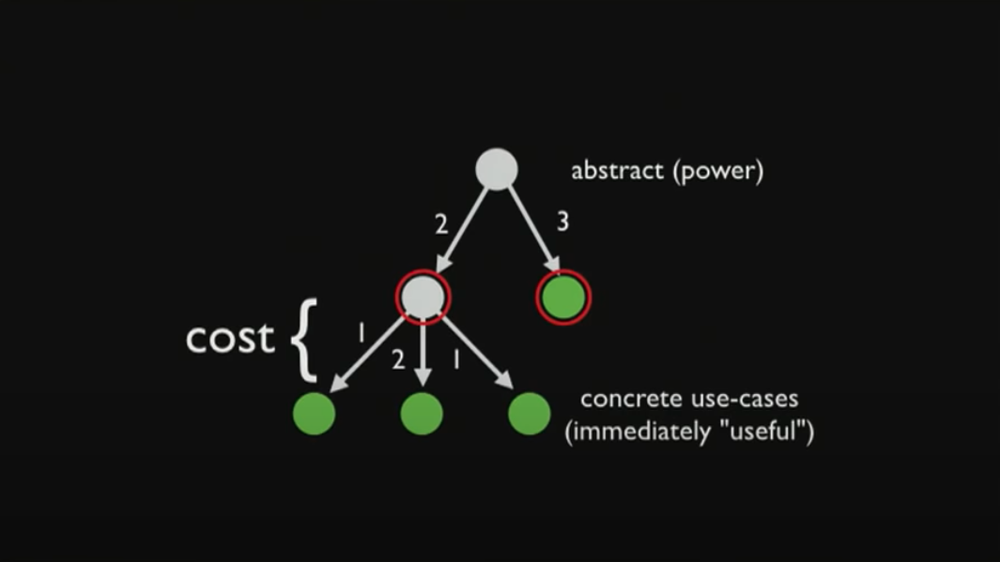

## Context

I wish it's easy to refactor the abstract components and fix both cross-feature and feature-specific bugs. But it's getting harder and harder as the number of our layers and abstraction increases.

So, should we avoid abstraction? Absolutely not. But we should have the ability to distinguish whether our abstraction is a good one or a bad one.

No abstraction is better than wrong abstraction. It's very easy to go with an abstraction that looks really promising and makes sense to you. What happens a lot is that we try so hard to avoid the spaghetti code that we create this lasagna code where there are so many layers that you don't know what's going on anymore at all. Finally, we find ourselves being in deep water 😭

## Visualize the Cost of Abstraction

Before entering the demo part. I want to use this tree to illustrate that every abstraction has a cost. There is no free cost abstraction. So every time we drill up or down. We pay a cost.


(This image is copied from the slides of this [great talk](https://www.youtube.com/watch?v=mVVNJKv9esE&ab_channel=ReactEurope))

Power = The ability to drill down this level of abstraction and get to your concrete use cases.

## Let's do Wrong Abstraction

I will use a simple case to work through the steps listed in [The Wrong Abstraction](https://sandimetz.com/blog/2016/1/20/the-wrong-abstraction).

### 1. Programmer A sees duplication.

There is duplication between our `BookMenu` and `VideoMenu`.

```jsx
const BookMenu = ({ books }) => {
  const handleClick = book => {
    // navigate to the page of this book
  }

  const handleAddToPlaylist = book => {
    // add this book to user's playlist
  }

  return (
    <MenuList header="books menu">
      {books.map(book => {
        return (
          <MenuListRow
            key={book.title}
            title={book.title}
            description={book.description}
            authors={book.authors}
            publishAt={book.publishAt}
            onClick={() => handleClick(book)}
            onAddToPlaylist={() => handleAddToPlaylist(book)}
          />
        )
      })}
    </MenuList>
  )
}
```

```jsx
const VideoMenu = ({ video }) => {
  const handleClick = video => {
    // navigate to the page of this video
  }

  const handleAddToPlaylist = video => {
    // add this video to user's playlist
  }

  return (
    <MenuList header="videos menu">
      {videos.map(video => {
        return (
          <MenuListRow
            key={video.title}
            title={video.title}
            description={video.description}
            authors={video.authors}
            publishAt={video.publishAt}
            onClick={() => handleClick(video)}
            onAddToPlaylist={() => handleAddToPlaylist(video)}
          />
        )
      })}
    </BookList>
  )
}
```

### 2. Programmer A extracts duplication and gives it a name.

> This creates a new abstraction. It could be a new method, or perhaps even a new class.

Here, it's a new component.

```jsx
const SharedMenu = ({ header, items }) => {
  const handleClick = item => {
    // navigate to the page of this item
  }

  const handleAddToPlaylist = item => {
    // add this item to user's playlist
  }

  return (
    <MenuList header={header}>
      {items.map(item => {
        return (
          <MenuListRow
            key={item.title}
            title={item.title}
            description={item.description}
            authors={item.authors}
            publishAt={item.publishAt}
            onClick={() => handleClick(item)}
            onAddToPlaylist={() => handleAddToPlaylist(item)}
          />
        )
      })}
    </BookList>
  )
}
```

### 3. Programmer A replaces the duplication with the new abstraction.

Wow, so clean! 🚀

```jsx
const BookMenu = ({ books }) => {
  return <SharedMenu header="books menu" items={books} />
}

const VideoMenu = ({ videos }) => {
  return <SharedMenu header="videos menu" items={videos} />
}
```

### 4. Time passes.


### 5. A new requirement appears for which the current abstraction is almost perfect.

Please show a register modal for guests when they are trying to add a video to their playlist.

### 6. Programmer B gets tasked to implement this requirement.

> Programmer B feels honor-bound to retain the existing abstraction, but since it isn't exactly the same for every case, they alter the code to take a parameter, and then add logic to conditionally do the right thing based on the value of that parameter.

```diff
- const SharedMenu = ({ header, items }) => {
+ const SharedMenu = ({ header, items, isGuest = false }) => {
    const handleClick = item => {
      // navigate to the page of this item
    }

    const handleAddToPlaylist = item => {
+     if (isGuest) {
+       // show register modal
+       return
+     }

      // add this item to user's playlist
    }

    return (
      <MenuList header={header}>
        {items.map(item => {
          return (
            <MenuListRow
              key={item.title}
              title={item.title}
              description={item.description}
              authors={item.authors}
              publishAt={item.publishAt}
              onClick={() => handleClick(item)}
              onAddToPlaylist={() => handleAddToPlaylist(item)}
            />
          )
        })}
      </BookList>
    )
}
```

```jsx
const VideoMenu = ({ videos, isGuest }) => {
  return <SharedMenu header="videos menu" items={videos} isGuest={isGuest} />
}
```

> What was once a universal abstraction now behaves differently for different cases.

### 7. Another new requirement arrives.

> Programmer X.
> -> Another additional parameter.
> -> Another new conditional.
> -> Loop until code becomes incomprehensible.

New requirements such as:

- We have article writers now. Please add articles to our menu but don't let users add them to the playlist.
- We have live events now. Please add live events to our menu and hide the button for add-to-playlist.
- ...

### 8. You appear in the story about here, and your life takes a dramatic turn for the worse.

Dare we break the loop?


## In Closing

There must and have to be abstraction in our codebase after all. What we can do is break the loop mentioned above. We should not only add abstraction, but we should also delete them as part of our healthy development process. Write our unit tests or integration tests against the code that we actually care about that this code works against concrete features. And then these tests don't care about your abstraction. So we can inline the abstraction back whenever we want without breaking these tests. Finally, refactoring the abstract components and fixing both cross-feature and feature-specific bugs would not be a big challenge.

## Reference

- [The Wrong Abstraction - Sandi Metz](https://sandimetz.com/blog/2016/1/20/the-wrong-abstraction)
- [The WET Codebase - Dan Abramov](https://overreacted.io/the-wet-codebase/)
- [On the Spectrum of Abstraction - Cheng Lou](https://www.youtube.com/watch?v=mVVNJKv9esE&ab_channel=ReactEurope)
- [Design Systems: Walking the Line Between Flexibility and Consistency - Sid Kshetrapal](https://portal.gitnation.org/contents/walking-the-line-between-flexibility-and-consistency)
