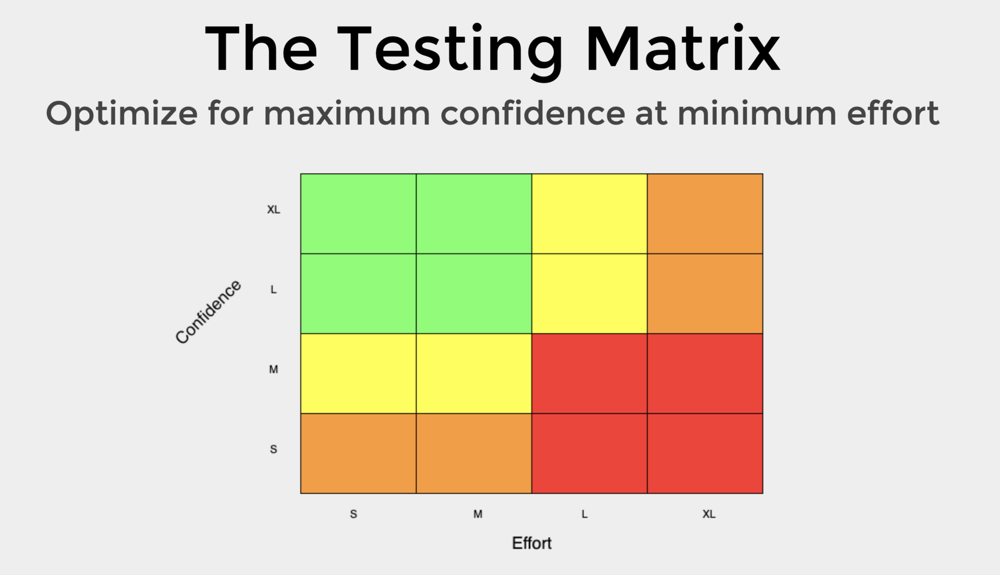

This is my note for [TestJS Summit 2021](https://testjssummit.com/).

# Testing Pyramid Makes Little Sense, What We Can Use Instead

Recommend: ♥︎♥︎♥︎♥︎♥︎

Video: [Watch on GitNation](https://portal.gitnation.org/contents/testing-pyramid-makes-little-sense-what-we-can-use-instead)

Slide: [Read on slide.com](https://slides.com/bahmutov/pyramid-testjsummit)

## The testing matrix

Roman introduced the testing matrix.

> Optimize for maximum confidence at minimum effort.



## Questions to ask for each iteration

Feature Iterations:

`Planning` --> `Coding / Testing` --> `Deploying` --> `Maintaining`

### Planning

- What are the available resources for testing?
- What testing tools are they currently familiar with?
- What is the cost of a bug in the feature?
- How important is it to verify the implementation details?

### Coding / Testing

- Does it spark joy?
- What's painful?
- How long does it take?
- How much code is it?
- Is the test readable?

### Deploying

- How scared are you to deploy? On Friday?
- What do you test manually?
- What did you miss?
- Did you go over budget? Or over the deadline?

### Maintenance

- How much flake do you accept?
- Can the implementation change?
- Do you hate the testing code?

# Test Effective Development

Recommend: ♥︎♡♡♡♡

Video: [Watch on GitNation](https://portal.gitnation.org/contents/test-effective-development)

Slide: [Read on slide.com](https://slides.com/bahmutov/pyramid-testjsummit)

## The testing dimensions

Shai introduced the testing dimensions:

- Boundaries: isolated / integrated
- Action Scope: single action / multi action
- Subject Type
- ...

Write `single action` + `integrated` tests for small app and `single action` + `isolated` tests for big app.

# Network Requests with Cypress

Introduce how to mock network requests with [cy.request](https://docs.cypress.io/api/commands/server#cy-request) and [cy.intercept](https://docs.cypress.io/api/commands/intercept) in Cypress.

Recommend: ♥︎♥︎♡♡♡

Video: [Watch on GitNation](https://portal.gitnation.org/contents/network-requests-with-cypress)

# Playwright Test Runner

Introduce [Playwright](https://playwright.dev/) which is a new tool for end-to-end testing for modern web apps.

Recommend: ♥︎♥︎♡♡♡

Video: [Watch on GitNation](https://portal.gitnation.org/contents/playwright-test-runner)

# It's a (Testing) Trap! - Common Testing Pitfalls and How to Solve Them

Recommend: ♥︎♥︎♥︎♡♡

Video: [Watch on GitNation](https://portal.gitnation.org/contents/its-a-testing-trap-common-testing-pitfalls-and-how-to-solve-them)

## Three pain points

Ramona's three pain points of testing are:

- Slow test
- Tests are painful to maintain
- [Heisenbug](https://en.wikipedia.org/wiki/Heisenbug#:~:text=In%20computer%20programming%20jargon%2C%20a,one%20attempts%20to%20study%20it.)

## Traps

### First trap

```js
// Jest

describe("deprecated.plugin", () => {
  it("should throw error", () => {
    // ...
  })
})
```

You should know instantly what your tests are doing. But we couldn't do it from the above example.

After applying the "three part" rule:

```js
// Jest

describe("deprecated.plugin", () => {
  it("Property: Should throw an error if the deprecated prop is used", () => {
    // ...
  })
})
```

1. What is being tested? It's the property in this case.
2. Under what circumstances and scenario do we test? It's the usage of the deprecated property in this case.
3. What is the expected result of the test? It's the error thrown in this case.

### Second trap

```js
// Jest

describe("Context menu", () => {
  it("should open the context menu on click", async () => {
    const wrapper = createWrapper()
    expect(wrapper.vm).toBeTruthy()
    await wrapper.trigger("click")
    const selector = ".sw-context-menu"
    expect(wrapper.find(selector).isVisible()).toBeTruthy()
  })
})
```

The structure is not arranged properly at all.

After applying the "Arrange-Act-Assert" pattern:

```js
// Jest

describe("Context menu", () => {
  it("should open the context menu on click", async () => {
    // Arrange
    const wrapper = createWrapper()
    const selector = ".sw-context-menu"
    // Act
    await wrapper.trigger("click")
    // Assert
    expect(wrapper.vm).toBeTruthy()
    expect(wrapper.find(selector).isVisible()).toBeTruthy()
  })
})
```

1. **Arrange** all necessary preconditions and inputs.
2. **Act** on the object or method under test.
3. **Assert** that the expected results have occurred.

### Third trap

```js
// Cypress

it("should create and read product", () => {
  //...
  cy.get(".sw-field-product-name").type("Foo")
  cy.get(".sw-select-product__select_manufacturer").type("Bar")
  //...
})
```

Use meaningful name instead of foobar.

```js
// Cypress

it("should create and read product", () => {
  //...
  cy.get(".sw-field-product-name").type("T-Shirt Ackbar")
  cy.get(".sw-select-product__select_manufacturer").type("Space Company")
  //...
})
```

# Test your UI in the REAL Browser

Recommend: ♥︎♥︎♡♡♡

Video: [Watch on GitNation](https://portal.gitnation.org/contents/test-your-ui-in-the-real-browser)

## Interactive stories

Gert introduced a new feature [interactive stories](https://storybook.js.org/docs/react/essentials/interactions) released at storybook@6.4.

- ✅ Runs in a real browser
- ⚡️ No waiting and no-flake
- 🐙 Powered by Testing Library
- 🛠 Low maintenance
- 🔍 Fast visual debugging

Post: [Read on storybook.js.org/blog](https://storybook.js.org/blog/interactive-stories-beta/)

## Interaction testing

Gert introduced a coming feature [interaction testing](https://storybook.js.org/docs/react/writing-tests/interaction-testing) that will be released at storybook@6.5 and storybook@7.0.

- ✅ Test interactions while developing
- 🐛 Debug tests interactively in a live browser
- ⚡️ Run tests in parallel via command line
- 🎭 Powered by Jest, Playwright, and Testing Library
- 👀 Watch mode, filters, and the ergonomics you'd expect
- 🛠 Customizable API with fully-configurable "eject" mode

Post: Read on [storybook.js.org/blog](https://storybook.js.org/blog/interaction-testing-with-storybook/)

# Tests That Help you Find Defects Faster

Recommend: ♥︎♥︎♥︎♡♡

Video: [Watch on GitNation](https://portal.gitnation.org/contents/tests-that-help-you-find-defects-faster)

## Pitfalls

### Split "and" into two tests

```js
import { failTest } from "./failTest"

describe("use cases", () => {
  describe("Database connector", () => {
    it("should be possible to read from and write to the database.", () => {
      failTest()
    })
  })
})
```

After splitting the "and" into two tests:

```js
import { failTest } from "./failTest"

describe("use cases", () => {
  describe("Database connector", () => {
    it("should be possible to read from the database.", () => {
      failTest()
    })

    it("should be possible to write to the database.", () => {
      failTest()
    })
  })
})
```

### The use of assertions

You can express everything as a boolean expression and make it a `true` or `false` check. But the test runner will just tell us it expected `true` but it received `false`. This forces us to open up the editor and navigate to the test file to figure out what's going on.

```js
describe("Better assertions", () => {
  describe("property assertions", () => {
    it("should be possible to nicely check for a property.", () => {
      const user = { name: "Jane" }

      expect(user.name === "John").toEqual(true)
    })
  })
})
```

After using better assertion:

```js
describe("Better assertions", () => {
  describe("property assertions", () => {
    it("should be possible to nicely check for a property.", () => {
      const user = { name: "Jane" }

      expect(user).toHaveProperty("name", "John")
    })
  })
})
```
