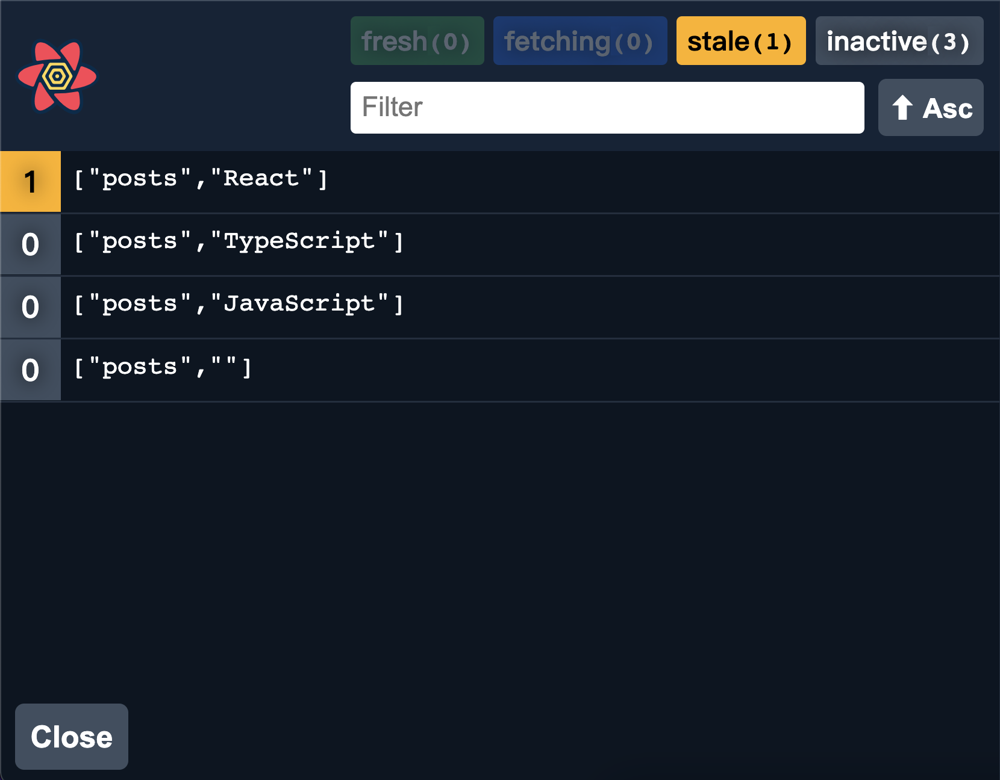

As a frontend developer, it's essential to know how to handle API race conditions. In this post, I want to show you how to handle it with different libraries. From the old school ones `redux-saga`, `redux-observable` to the more modern ones `react-query`, `apollo-client` and even with `fetch` only.

The code used to demo for each case can be found in [this repository](https://github.com/wtlin1228/graphql-playground). Feel free to open PRs for adding more examples.


# A simple GraphQL API server

The server provides [this schema](https://github.com/wtlin1228/graphql-playground/blob/main/apps/server/src/app/modules/post/post.graphql#L18):

```
type Post {
  id: ID!
  title: String!
}

type Query {
  searchPosts(keyword: String): [Post]!
}
```

Whenever you query `searchPosts` with any `keyword`, it will response to you with 4 posts. For example, if you query `searchPosts` with keyword `The Lion King`, you will get:

- The Lion King - 1
- The Lion King - 2
- The Lion King - 3
- The Lion King - 4

In order to make the demo easier, I choose `React`, `JavaScript` and `TypeScript` as special keywords. The server will sleep for `1s`, `5s` and `10s` before responding to those queries if the keyword is the special one.

You can also start the server locally by `npm start server` then open `http://localhost:3333/graphql` and try it yourself.

# Redux Saga

Use [takeLatest](https://redux-saga.js.org/docs/api/#takelatestpattern-saga-args) effects.

```js
import { takeLatest } from `redux-saga/effects`

function* fetchUser(action) {
  ...
}

function* watchLastFetchUser() {
  yield takeLatest('USER_REQUESTED', fetchUser)
}
```

Here is the [redux-saga example](https://github.com/wtlin1228/graphql-playground/tree/main/apps/client/src/app/demos/api-race-conditions/redux-saga) in my demo repository.

# Redux Observable

Use [switchMap](https://rxjs.dev/api/operators/switchMap) operator.

```ts
export default function searchPostsEpic(action$) {
  return action$.pipe(
    ofType(searchPosts.type),
    switchMap(action =>
      from(fetchPosts(action.payload.keyword)).pipe(
        map(response => searchPostsSuccess({ posts: response.searchPosts })),
        catchError(() => of(searchPostsFail()))
      )
    )
  )
}
```

Here is the [redux-observable example](https://github.com/wtlin1228/graphql-playground/tree/main/apps/client/src/app/demos/api-race-conditions/redux-observable) in my demo repository.

# Apollo Client

Use [useQuery](https://www.apollographql.com/docs/react/data/queries#usequery-api) directly.

```ts
const { loading, data } = useQuery(
  gql`
    query SearchPostsQuery($keyword: String!) {
      searchPosts(keyword: $keyword) {
        id
        title
      }
    }
  `,
  {
    variables: { keyword },
  }
)
```

Apollo Client handles API request race conditions naturally. Because Apollo Client will generate three cache keys to cache each query:

- `searchPosts({"keyword":"React"})`
- `searchPosts({"keyword":"JavaScript"})`
- `searchPosts({"keyword":"TypeScript"})`

You can install the Apollo Client DevTools and try it yourself:


Here is the [apollo-client example](https://github.com/wtlin1228/graphql-playground/tree/main/apps/client/src/app/demos/api-race-conditions/apollo-client) in my demo repository.

## An interesting behavior

Apollo Client will cache the last query you request. If you click `TypeScript` -> `JavaScript` -> `React`, you will only get one new cache `searchPosts({"keyword":"React"})`. Then click `TypeScript` -> `React`. You will get a new cache `searchPosts({"keyword":"TypeScript"})` since the last query is the `TypeScript` one.

# React Query

Use [useQuery](https://react-query.tanstack.com/guides/queries#query-basics) directly.

<!-- prettier-ignore-start -->

```ts
const { status, data } = useQuery(
  ["posts", keyword], 
  () => request(
    endpoint,
    gql`
      query SearchPostsQuery {
        searchPosts(keyword: "${keyword}") {
          id
          title
        }
      }
    `
  )
)
```

<!-- prettier-ignore-end -->

React Query also handles API request race conditions naturally. The unique key you provide is used internally for refetching, caching, and sharing your queries throughout your application:

- `['posts', 'React']`
- `['posts', 'JavaScript']`
- `['posts', 'TypeScript']`

You can open the React Query DevTools and try it yourself:



Here is the [react-query example](https://github.com/wtlin1228/graphql-playground/tree/main/apps/client/src/app/demos/api-race-conditions/react-query) in my demo repository.

## What's different from Apollo Client

React Query will cache every query you request. Therefore, if you click `React` -> `JavaScript` -> `TypeScript`, you will get three caches after each network request finishes instead of one. In my opinion, it brings us better user experience in some cases such as searching.

# Without any library

Use [AbortController](https://developer.mozilla.org/en-US/docs/Web/API/AbortController)'s property `signal` and method `abort` to cancel the previous network request.

```ts
useEffect(() => {
  const controller = new AbortController()
  const signal = controller.signal

  fetch(endpoint, {
    method: "POST",
    signal,
    headers: {
      "Content-Type": "application/json",
    },
    body: JSON.stringify({
      query: `
          query SearchPostsQuery {
            searchPosts(keyword: "${keyword}") {
              id
              title
            }
          }
        `,
    }),
  }).then(/* do something */)

  return () => {
    controller.abort()
  }
}, [keyword])
```

You can open the Network tab in devTools and try it yourself:


Here is the [no-library example](https://github.com/wtlin1228/graphql-playground/tree/main/apps/client/src/app/demos/api-race-conditions/no-library) in my demo repository.

# Conclusion

Hope the ☃ race condition ❅ doesn't bother you anyway. 😂
