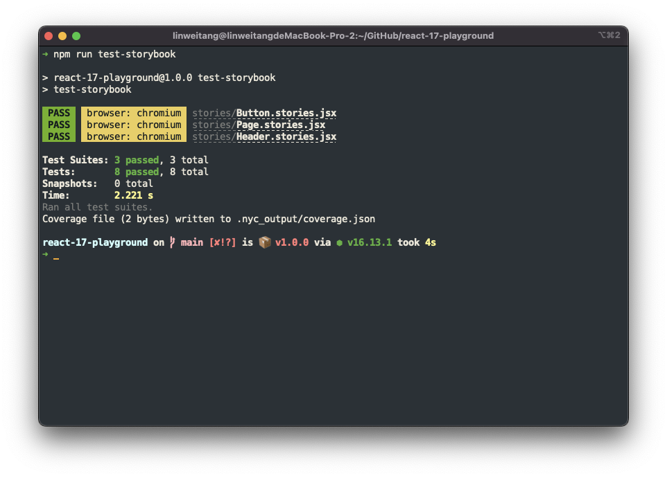
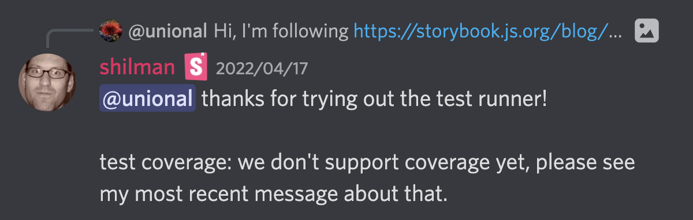

How do you test your shared UI library?

When I was working on our team's shared UI library built with [Storybook][storybook], I came across a situation where we needed a solution to test it to get more confidence.

Here are the questions that I asked myself during the planning stage:

- What are the available resources for testing?
- What testing tools are we currently familiar with?
- What is the cost of a bug in our shared UI library?
- How important is it to verify the implementation details?

---

> Question #1: What are the available resources for testing?

- Storybook's Interaction Features
- Storybook's Visual Testing
- Enzyme
- Testing Library
- Cypress
- Playwright

## Storybook's Interaction Features

Storybook 6.4 announced [Interactions][storybook-interactions] and [Interactions Testing][storybook-interaction-testing]. Those features are powered by Jest, Playwright and Testing Library.

The interaction features look very promising. I have created a [demo repo][demo-repo] for you to play those features locally.

### Interactions

The `play` function in Storybook allows you to simulate user interactions to run after a story renders. With the Interactions addon, you have a way to visualize and debug these interactions.

In the demo repo, run `$ npm run storybook` and open the interactions addon tab of http://localhost:6006/?path=/story/example-button--primary.

### Interaction Testing

Interaction Testing combines the power of play functions with a new [test runner and assertion library][storybook-test-runner]. These tests run in a live browser and can be executed via the command line or your CI server.

In the demo repo, run `$ npm run test-storybook`.

> **WARNING**: It currently doesn't support coverage yet!

See this discussion in [Discord][storybook-not-support-coverage]

But Playwright does support [coverage collecting][playwright-collect-coverage] with option `collectCoverage: true`. So maybe Storybook will also support it in the future.

In the [demo repo][demo-repo-extract-assertion], you can see how I extract the assertions of Interaction Testing then run them with Jest to collect coverage.

## Storybook's Visual Tests

Visual tests, also called visual regression tests, catch bugs in UI appearance. They work by taking screenshots of every story and comparing them commit-to-commit to identify changes. See how to do visual tests in [Storybook][storybook-visual-testing].

I personally prefer not to do visual testing for those [atom][atomic-design-atom] components such as label, input and button. Since visual tests will be broken whenever we modify those atom components. So I will only do visual testing for the components of higher levels. For example, dialog, form and search bar.

## Enzyme

Our tests are written with Enzyme in our codebase now.

Enzyme is useful to test component as a unit. But our target is a shared UI library. So I prefer to ignore the implementation details.

Also, it's a bit slow to update.

- [Why is testing implementation details bad?](https://kentcdodds.com/blog/testing-implementation-details#why-is-testing-implementation-detailsbad)
- [Enzyme is dead. Now what?](https://dev.to/wojtekmaj/enzyme-is-dead-now-what-ekl)

## Testing Library

`React-testing-library` is officially recommended by react. It internally keeps us away from the pitfalls of writing **false negative** and **false positives** tests.

- Can break when you refactor application code. `False negatives`
- May not fail when you break application code. `False positives`

Avoid testing the implementation details is one of its design principles.

## Cypress

Cypress is the most popular end-to-end testing framework now.

Cypress enables you to write both end-to-end and component tests. But its component testing is still in alpha and I haven't seen how to collect coverage with it.

Cypress can test anything that runs in a browser.

## Playwright

Playwright is developed by Microsoft. It's a framework for Web Testing and Automation like Cypress does.

Storybook's Interaction Testing feature is built with Playwright. So I wouldn't consider using Playwright directly.

---

> Question #2: What testing tools are we currently familiar with?

We are familiar with Storybook, Testing Library and Cypress.

---

> Question #3: What is the cost of a bug in our shared UI library?

We will have to deploy a hotfix if there is a bug causing the functionality broken.

But we can wait for next release if the bug is some styling doesn't match designer's expectation.

---

> Question #4: How important is it to verify the implementation details?

Not important at all. We only care about what users can see.

---

# How do other UI libraries test their components?

## Material UI

Migration from Enzyme to Testing Library since v5.0.0.

Use playwright to write e2e tests.

## Ant Design

Recommend using Testing Library on Ant Design Pro.

Use puppeteer to write e2e tests.

# Conclusion

|                     | confidence | easy to write | maintainability | happiness |
| ------------------- | ---------- | ------------- | --------------- | --------- |
| Enzyme              | 6          | 4             | 5               | 4         |
| Testing Library     | 7          | 8             | 7               | 8         |
| Visual Testing      | 7          | 10            | 9               | 8         |
| Interaction Testing | 9          | 8             | 8               | 10        |
| Cypress             | 9          | 6             | 8               | 8         |

- Migrate to Testing Library from Enzyme. Because:
  - Enzyme is dead
  - the implementation details are not important
- Write unit & integration tests with Testing Library. Because:
  - it reduces the `False negatives` and `False positives`
  - it updates fast
  - it supports React 18 already
- Write end-to-end tests with Storybook Interaction Testing. Because:
  - the writing experience is almost the same as using Testing Library
  - our UI Library is built with Storybook
  - we can play the interactions in storybook
  - it's power by Playwright
  - some cases are hard to test without real browser
- Write visual regression tests with Storybook Visual Tests. Because:
  - chromatic allows us to run visual tests with zero-config
  - it helps us catch the visual bugs in composited components
- Collect coverage from Testing Library and Storybook Visual Tests. Because:
  - it's easy to setup
  - Storybook Interaction Testing doesn't support coverage collecting now
    (Check how do I overcome it in my [demo repo][demo-repo-extract-assertion])

<!-- prettier-ignore-start -->
[demo-repo]: https://github.com/wtlin1228/storybook-interaction-testing
[demo-repo-extract-assertion]: https://github.com/wtlin1228/storybook-interaction-testing#minimize-the-risks
[storybook]: https://storybook.js.org/
[storybook-interactions]: https://storybook.js.org/docs/react/essentials/interactions/
[storybook-interaction-testing]: https://storybook.js.org/blog/interaction-testing-with-storybook/
[storybook-test-runner]: https://github.com/storybookjs/test-runner
[storybook-not-support-coverage]: https://discord.com/channels/486522875931656193/691505730125168682/965162639321882634
[storybook-visual-testing]: https://storybook.js.org/docs/react/writing-tests/visual-testing
[playwright-collect-coverage]: https://github.com/playwright-community/jest-playwright#:~:text=collectCoverage%20%3C%5Bboolean%5D%3E.%20Enables%20the%20coverage%20collection%20of%20the%20saveCoverage(page)%20calls%20to%20the%20.nyc_output/coverage.json%20file
[atomic-design-atom]: https://bradfrost.com/blog/post/atomic-web-design/#atoms
[twitter-kcd]: https://twitter.com/kentcdodds

<!-- prettier-ignore-end -->
