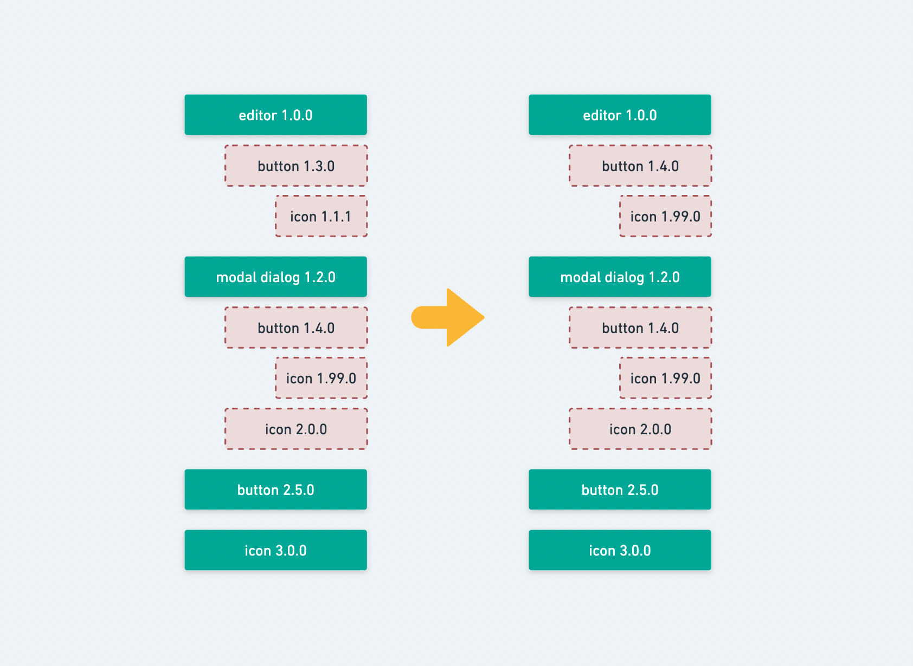
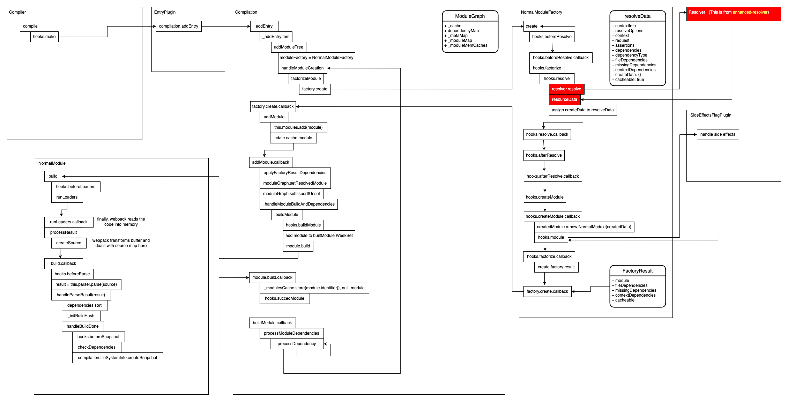
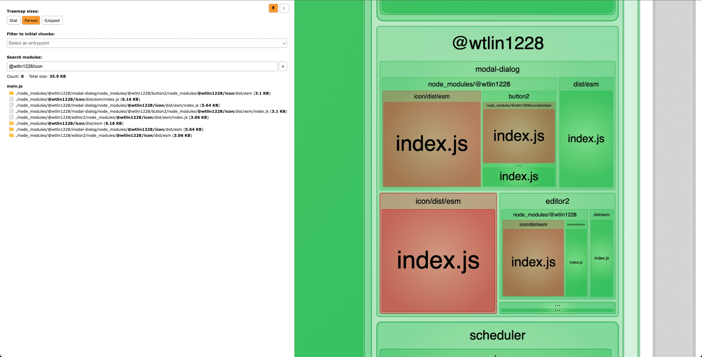
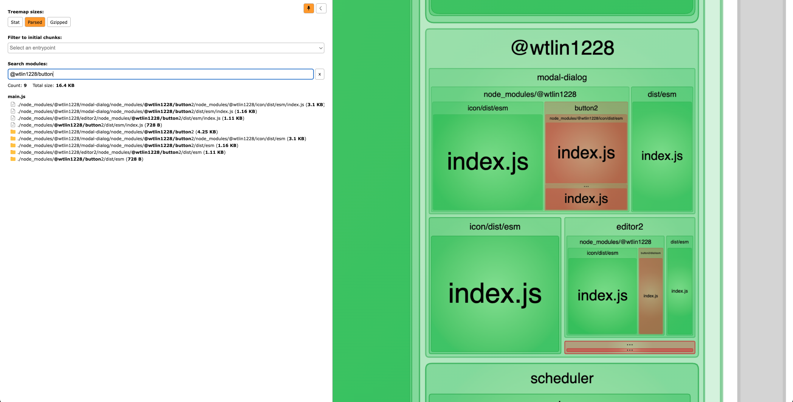
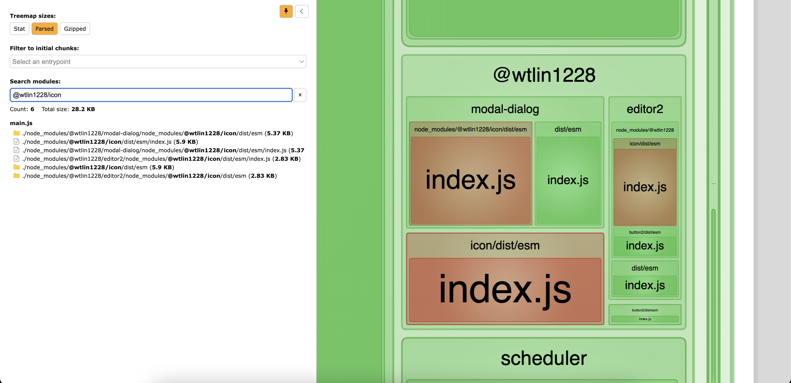
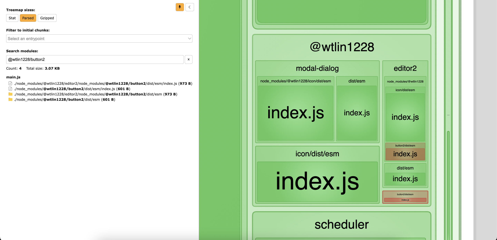

# Outline

```
.
├── The problem of duplicate dependencies
├── Deduplication in package manager
│   ├── Deduplication in yarn
│   └── Deduplication in npm
├── Deduplication in webpack
│   ├── How does webpack work
│   ├── Resolve to the same module
│   └── Custom webpack plugin
└── The end
```

# The problem of duplicate dependencies

Duplicate dependencies can grow as your applications grow. Each dependency listed inside the `dependencies` of `package.json` has its own dependencies. So the final number of all packages installed in a project can be in hundreds. And it will not be strange for us to find out some of the dependencies are duplicated.

One of my applications which has nearly 100 dependencies (devDependencies are excluded) installed 305 unique libraries, or 352 if we count duplicates.

When it comes to **Core Web Vitals**, reducing JavaScript payloads downloaded at startup will contribute to better [First Input Delay (FID)](https://web.dev/fid/) and [Interaction to Next Paint (INP)](https://web.dev/inp/) times. This is why we should care about those duplicates. In a nutshell, it's always better to have smaller bundles.

# Deduplication in package manager

Let's say we have installed 4 libraries as the application's dependencies:

- editor 1.0.0 (depend on button@1.3.0)
- modal-dialog 1.2.0 (depend on button@1.4.0 and icon@2.0.0)
- button 2.5.0
- icon 3.0.0

and inside the `node_modules` folder we'll see this structure:

```
.
└── node_modules
    ├── editor
    │   └── node_modules
    │       ├── button-1.3.0
    │       └── icon-1.1.1
    ├── modal-dialog
    │   └── node_modules
    │       ├── button-1.4.0
    │       │   └── node_modules
    │       │       └── icons-1.99.0
    │       └── icon-2.0.0
    ├── button-2.5.0
    └── icon-3.0.0
```

then can first do some deduplication by modifying the lock file.



## Deduplication in yarn

Modify `yarn.lock`

```
"button@^1.3.0", "button@^1.4.0":
  version "1.4.0"
  resolved "link-to-down-button-1.4.0"
  dependencies:
    "@wtlin1228/icon" "1.99.0"
```

## Deduplication in npm

Modify `package-lock.json`

```
"editor": {
  "version": "1.0.0",
  "resolved": "link-to-down-editor-1.0.0",
  "requires": {
    "button": "^1.3.0"
  },
  "dependencies": {
    "button": {
      "version": "1.4.0",
      "resolved": "link-to-down-button-1.4.0",
      "requires": {
        "icon": "1.99.0"
      }
    },
    "icon": {
      "version": "1.99.0",
      "resolved": "link-to-down-icon-1.99.0",
      "requires": {}
    }
  }
},
```

# Deduplication in webpack

Even if dependencies are "deduped" on `yarn.lock` or `package-lock.json` level and we "officially" have only 2 versions of buttons and 3 versions of icons in our lock file, every single package with button@1.4.0 and icon@1.99.0 as dependencies will install its own copies of them.

So, if a project is bundled with webpack, how exactly does it handle the situation from above? It doesn’t, actually (there was a webpack dedup plugin in the long past, but it was removed after webpack 2.0).

## How does webpack work

Webpack resolves the dependencies via [enhanced-resolve](https://github.com/webpack/enhanced-resolve) and [module resolution algorithm](https://nodejs.org/api/modules.html) under the hood. TL;DR: every time a file in editor does `import Button from 'button'`, node will try to find this button in the closest `node_modules`.

So the final asks for the buttons will be:

- `<rootPath>/node_modules/editor/node_modules/button/index.js`
- `<rootPath>/node_modules/modal-dialog/node_modules/button/index.js`
- `<rootPath>/node_modules/button/index.js`

and asks for icons will be:

- `<rootPath>/node_modules/editor/node_modules/icon/index.js`
- `<rootPath>/node_modules/modal-dialog/node_modules/button/node_modules/icon/index.js`
- `<rootPath>/node_modules/modal-dialog/node_modules/icon/index.js`
- `<rootPath>/node_modules/icon/index.js`

## Resolve to the same module

There are two identical `button@1.4.0` and two identical `icon@1.99.0`. To further deduplicate them, we can leverage the rich plugin interface provided by webpack. Because webpack uses [tapable](https://github.com/webpack/tapable) almost everywhere internally, there are plenty of hooks that we can tap to.

In this case, `normalModuleFactory.hooks.beforeResolve` is what we need. We can replace the `resolveData.request` right before webpack resolves one module.



## Custom webpack plugin

The plugin is available here: https://github.com/wtlin1228/deduplicate-webpack-plugin

All you need to do is add it to your Webpack plugins, and it will just work:

```js
import DeduplicateWebpackPlugin from "deduplicate-webpack-plugin"

// webpack config
const config = {
  // ...

  plugins: [
    // ...

    new DeduplicateWebpackPlugin({
      cacheDir,
      rootPath,
      packageManager: "yarn", // or npm
    }),

    // ...
  ],

  // ...
}
```

# The end

I know it's annoying to set up the playground from the ground up. You could just use mine directly if you want to give it a try. https://github.com/wtlin1228/webpack-bundle-duplications

Without `DeduplicateWebpackPlugin`, you will find that there are 4 icons and 3 buttons bundled together by webpack by default.





With `DeduplicateWebpackPlugin`, there are only 3 icons and 2 buttons inside our bundle.





The total bundle size of `node_modules/@wtlin1228` is reduced by **20.5%**. So, that could be a good optimization for those projects which are more complex. Jira uses this strategy to shrink their overall bundle size 10% approximately and about 300ms [TTI](https://web.dev/tti/) improvement.

# Reference

- https://www.atlassian.com/engineering/performance-in-jira-front-end-solving-bundle-duplicates-with-webpack-and-yarn
- https://github.com/atlassian-labs/webpack-deduplication-plugin
