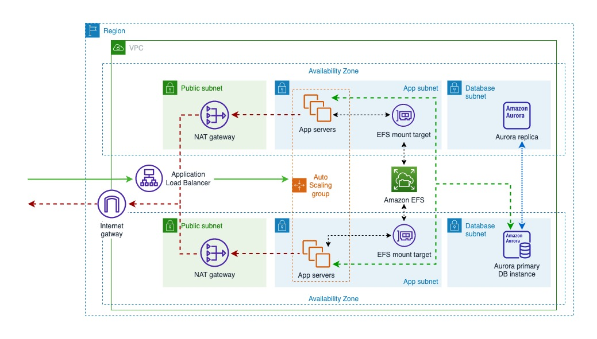
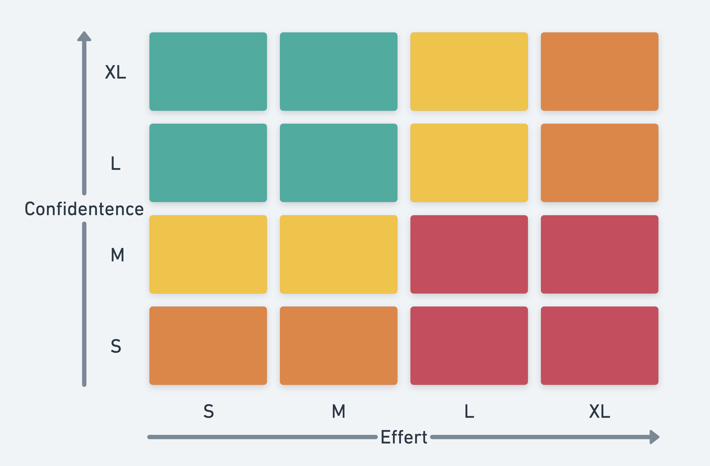

## Tap Dance

2022 I started learning tap dance. And I'm looking forward to my first performance in January 2023.

## Cloud Architecture

I took three courses hosted by [AWS Training and Certification](https://aws.amazon.com/training/). Now, I'm more confident at designing reliable cloud architecture.

## Better Monorepo Management

I brought [Nx](https://nx.dev/) into our monorepo to cache our task results and explore the dependency graph. It's amazing how easy it was to turn our repo into a Nx package-based repo. Then we could further turn it into a Nx integrated-based repo step by step.

## Better Testing Strategy

I persuaded my team to take the following actions in order to optimize for maximum confidence at minimum effort:

- do component tests with [testing-library](https://testing-library.com/) instead of [enzyme](https://enzymejs.github.io/enzyme/)
- do integration tests with [msw](https://mswjs.io/)
- do [interaction tests](https://storybook.js.org/docs/react/writing-tests/interaction-testing) in our storybook of UI library

## Better Component API Interface

I designed the new component API interface with this in mind:

> It should have a small API surface area. If you know how to use one component, you can guess how to use another component because the API interface is consistent.

I had a [note](https://github.com/wtlin1228/dev-note/blob/main/docs/design-system-hack-to-create-good-interface.md) here for myself.

## My Blog

Last year, I published 10 blog posts:

1. [Summary of TestJS Summit 2021](https://leonerd.gatsbyjs.io/0020-test-js-summit-2021/)
1. [Handle API request race conditions in React](https://leonerd.gatsbyjs.io/0021-api-request-race-conditions/)
1. [Visualize fiber tree with ASCII Art](https://leonerd.gatsbyjs.io/0022-visualize-fiber-tree-with-ascii-art/)
1. [Test the shared UI Library built with Storybook](https://leonerd.gatsbyjs.io/0023-test-the-shared-ui-library-built-with-storybook/)
1. [Summary of TypeScript Congress 2022](https://leonerd.gatsbyjs.io/0024-typescript-congress-2022/)
1. [React at Scale with Nx](https://leonerd.gatsbyjs.io/0025-react-at-scale-with-nx/)
1. [Baby Rustacean - Ownership](https://leonerd.gatsbyjs.io/0026-baby-rustacean-ownership/)
1. [Design System](https://leonerd.gatsbyjs.io/0028-design-system/)
1. [Deduplicate JS Bundles](https://leonerd.gatsbyjs.io/0029-deduplicate-js-bundles/)
1. [Empower Testing Library with Custom Query](https://leonerd.gatsbyjs.io/0030-empower-testing-library-with-custom-query/)

## Chrome Extension

I made a chrome extension [Web Presenter](https://chrome.google.com/webstore/detail/web-presenter/fcelpdljejcagbhalelapbihcccjkefn) so I can do presentation directly on any website without preparing for the slides. It's also very useful when I want to capture some UI screenshots then attach them in my PRs.

## Open Source

Last year I contributed to some open source projects such as `facebook/react`, `mdn/interactive-examples`, `rust-lang/book`, `testing-library/testing-library-docs` and `remix-run/remix`, etc.

## The Future

In 2023, I'm hoping to

- ship my new site
- persuade my team to use [Fragment Masking Pattern](https://the-guild.dev/blog/unleash-the-power-of-fragments-with-graphql-codegen) to build better isolated and reusable UI components
- migrate our error handling interface to [GraphQL Error Handling Interface](https://the-guild.dev/blog/graphql-error-handling-with-fp#better-modelisation-of-errors-using-union-and-interfaces) from the standard GraphQL "errors"
- migrate our monorepo [to Nx integrated-based repo from Nx package-based repo](https://nx.dev/concepts/integrated-vs-package-based)

And prepare for the relocation to Japan 🇯🇵
