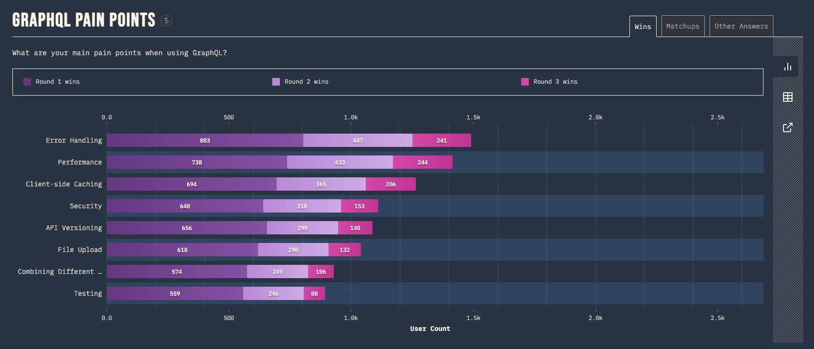
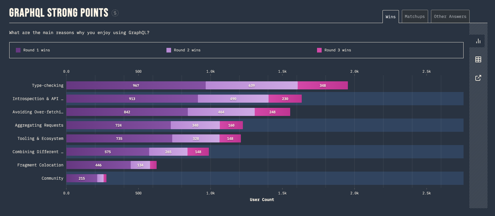

> In any situation, GraphQL can be very convincing. However, this is because it answers for all basic problems an APIs face anyway.
>
> Was GraphQL sold to you for solving your "basic problems" rather than for its strong design principles?
>
> Ask yourself, compared to without it, what will GraphQL do for your team?
>
> What’s the minimal architecture that your team needs to benefit from GraphQL?

These questions have been lingering in my mind since watching the talk, "Your GraphQL Groove" available at (https://portal.gitnation.org/contents/your-graphql-groove).

Despite using GraphQL since 2018, our team is still struggling with one of its top pain points, error handling. According to [the State of GraphQL 2022 report](https://2022.stateofgraphql.com/en-US/), this issue has consistently troubled GraphQL users. Although type checking is often cited as GraphQL's top benefit, our team has yet to fully realize its potential. In this post, I'll share our team's journey towards overcoming error handling and unlocking the benefits of type checking.





## Error Handling

When an error occurs in GraphQL, the standard error handling mechanism returns a JSON object containing a `data` key with the corresponding data for the invoked operation, and an `errors` key with an array of errors returned by the server. These errors include a message, location, and path.

```json
{
  "errors": [
    {
      "message": "User not found",
      "locations": [{ "line": 6, "column": 7 }],
      "path": ["user", 1]
    }
  ]
}
```

This standard error handling is not satisfactory for the many reasons:

- It is not easily parsable. It is more meant for a human user to read.
- It is not typed. You can add more information, e.g. an error code and other fields, but those are not part of the schema.
- It is not self-documented, making it difficult to determine which operations could fail by simply looking at the operation signature.
- It treats some domain results as errors or exceptions, even though they may be alternate results of the operation. For instance, an entity not found for a given ID or a user without permission to access an entity is part of the domain model. In contrast, runtime exceptions, such as the GraphQL server failing to communicate with the database or external microservice or an operation timing out due to slowness, are real exceptions, and we don't receive any result related to the domain model, just an unexpected runtime error.

### Our Current Approach

Rather than using the unparsable structure described above, we utilize a more structured approach:

```json
{
  "errors": [
    {
      "topLevelErrors": [
        {
          "errorType": "product number reaches limit",
          "errorPayload": {
            // could be anything
          }
        }
      ],
      "fields": {
        "name": ["name is too short", "name is duplicated"],
        "description": ["description is too long"]
      }
    }
  ]
}
```

While our approach is easier to parse, it is still not typed, self-documented, and it treats some domain results as errors. As a result, we cannot determine which errors could occur within a query or mutation by looking at the client-side code, making maintenance a challenge.

### Improved Error Handling with GraphQL Unions and Interfaces

GraphQL's support for Union types allows us to design our schema in a way that specifies all possible results, including both expected and unexpected error cases. For instance, we can do the `publishPost` mutation like this:

```gql
mutation publishPost {
  publishPost(input: { title: "", body: "Hello world" }) {
    __typename
    ... on Post {
      id
      createdAt
      title
      body
    }
    ... on PublishPostUserInputError {
      titleErrorMessage
      bodyErrorMessage
    }
  }
}
```

With this approach, we can get the expected results, or properly typed alternative results in case of errors, as shown below:

```json
{
  "data": {
    "publishPost": {
      "__typename": "PublishPostUserInputError",
      "titleErrorMessage": "Title too short",
      "bodyErrorMessage": null
    }
  }
}
```

Leveraging GraphQL Union types for error cases brings several benefits:

- Type-safety: errors are also typed, ensuring that the expected data is returned in the expected format.
- Consumers cannot ignore errors as they must be handled using inline fragments.
- Self-documented: the operation signature includes all possible cases (result and errors), reducing the need for additional documentation to explain possible error cases.
- Unexpected results are now just other possible results, simplifying error handling and reducing confusion.

## Type Checking with GraphQL Code Generator

TypeScript provides the ability to check types at compile-time, helping you catch errors early and improving code quality. To enable this for your GraphQL API, you can use the `@graphql-codegen/cli` tool to automatically generate TypeScript types based on your schema.

For example, given this schema:

```gql
enum Role {
  USER
  ADMIN
}

type User {
  id: ID!
  username: String!
  email: String!
  role: Role!
}
```

`@graphql-codegen/cli` generates the following TypeScript types:

```ts
export type Scalars = {
  ID: string
  String: string
  Boolean: boolean
  Int: number
  Float: number
  Date: any
}

export enum Role {
  User = "USER",
  Admin = "ADMIN",
}

export type User = {
  __typename?: "User"
  id: Scalars["ID"]
  username: Scalars["String"]
  email: Scalars["String"]
  role: Role
}
```

### Generate TypedDocumentNode

GraphQL Code Generator has evolved over time to support a range of features and integrations. The roadmap of GraphQL Code Generator can be divided into the following phases:

- (2016) Initial focus on TypeScript Types
  - Generate basic TypeScript types for the schema
- (2019 - 2022) Expansion to Other Languages and Frameworks
  - Support for additional languages, such as Java and C#
  - Integration with popular GraphQL client libraries, such as Apollo, URQL, and Angular
- (Next) `TypedDocumentNode`
  - The latest phase is the adoption of `TypedDocumentNode`, which is now supported by most GraphQL client libraries as of 2022
  - Client libraries supporting `TypedDocumentNode` include `@apollo/client`, `@urql/core`, `graphql-js`, `graphql-request`, and [more](https://github.com/dotansimha/graphql-typed-document-node#built-in-support)

So instead of generating the hooks for the existing clients, the recommended approach is working with function signature overloading and `TypedDocumentNode` for inferring the correct GraphQL operation and variables type by using the `@graphql-codegen/client-preset`.

```gql
query findUser($userId: ID!) {
  user(id: $userId) {
    ...UserFields
  }
}

fragment UserFields on User {
  id
  username
  role
}
```

And then generate `TypedDocumentNode` types for your query and fragment like this:

```ts
export type UserFieldsFragment = {
  __typename?: "User"
  id: string
  username: string
  role: Role
}

export const UserFieldsFragmentDoc = {
  kind: "Document",
  definitions: [
    // definitions
  ],
} as unknown as TypedDocumentNode<UserFieldsFragment, unknown>

export type FindUserQuery = {
  __typename?: "Query"
  user?: {
    __typename?: "User"
    id: string
    username: string
    role: Role
  } | null
}

export type FindUserQueryVariables = Exact<{
  userId: Scalars["ID"]
}>

export const FindUserDocument = {
  kind: "Document",
  definitions: [
    // definitions
  ],
} as unknown as TypedDocumentNode<FindUserQuery, FindUserQueryVariables>
```

Although the `TypedDocumentNode` interface [itself](https://github.com/dotansimha/graphql-typed-document-node/blob/master/packages/core/src/index.ts) is super simple, it's impressive to see the level of collaboration and consensus within the GraphQL community to support it. The GUILD team behind the GraphQL Code Generator deserves special recognition for their work behind the scenes. Thank you for your contributions!

### Adapting The Fragment Masking Pattern

GraphQL Fragments are the main building blocks for declaring data dependencies for React Components in Relay. These reusable units in GraphQL represent a set of data to query from a GraphQL type exposed in the schema. The GUILD team has brought the most important parts from Relay into other GraphQL clients for building and scaling applications .

This pattern offers several benefits:

- Fragmentized component tree

  Instead of writing a single GraphQL operation document per visible component or extracting the component properties from a single query operation document type, which is often cumbersome, multiple fragment definitions can be composed up to a single query operation that is sent to the server. This reduces the amount of concurrent requests and together with `@defer` and `@stream` is an actual improvement in the performance of the application.

- Colocate GraphQL documents with the component code

  GraphQL operations are written within the component code, rather than in a dedicated file. This approach avoids the issue of deleting component code but forgetting to delete the corresponding operation or fragment definitions, resulting in dead code.

- Data (fragment) masking

  Components can only access the data defined in their fragment definitions, ensuring they remain self-contained building blocks that can be re-used.

If you're interested in this pattern, I highly recommend reading this great post - [Unleash the power of Fragments with GraphQL Codegen](https://the-guild.dev/blog/unleash-the-power-of-fragments-with-graphql-codegen)

## Conclusion

By utilizing **Error Handling with GraphQL Unions and Interfaces** and **Type Checking with GraphQL Code Generator**, we can overcome one of the top pain points of using GraphQL and start to fully enjoy its benefits. We can avoid dead code and reduce runtime errors, while making our components more reusable. Incorporating these best practices can result in a more efficient and robust codebase, making GraphQL a valuable tool for developing modern applications.

I created a demo repository (https://github.com/wtlin1228/play-graphql-code-generator) that I used to demonstrate to my team how to integrate GraphQL Code Generator. The repository also includes examples of how to generate msw mock functions and zod schema validators.

## References

- [Article - 200 OK! Error Handling in GraphQL](https://sachee.medium.com/200-ok-error-handling-in-graphql-7ec869aec9bc)
- [Article - Handling GraphQL errors like a champ with unions and interfaces](https://blog.logrocket.com/handling-graphql-errors-like-a-champ-with-unions-and-interfaces/)
- [Article - A Guide to GraphQL Errors](https://productionreadygraphql.com/2020-08-01-guide-to-graphql-errors)
- [Article - GraphQL error handling to the max with Typescript, codegen and fp-ts](https://the-guild.dev/blog/graphql-error-handling-with-fp)
- [Article - Unleash the power of Fragments with GraphQL Codegen](https://the-guild.dev/blog/unleash-the-power-of-fragments-with-graphql-codegen)
- [Video - Laurin Quast - Are you using GraphQL the intended way? - GraphQL Berlin Meetup #26](https://www.youtube.com/watch?v=YLytItSZCII)
- [Video - Your GraphQL Groove](https://portal.gitnation.org/contents/your-graphql-groove)
