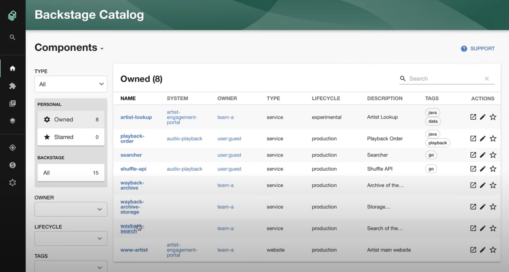
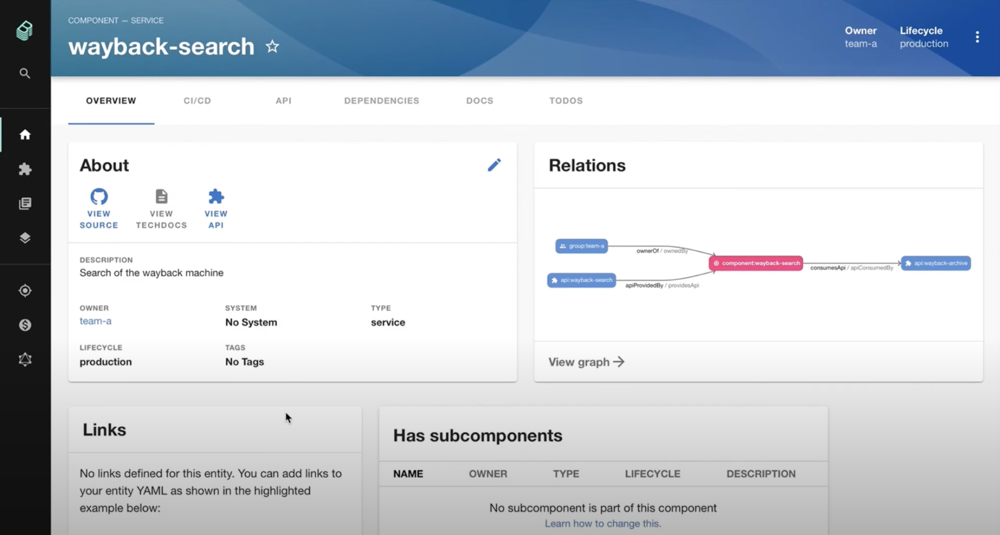
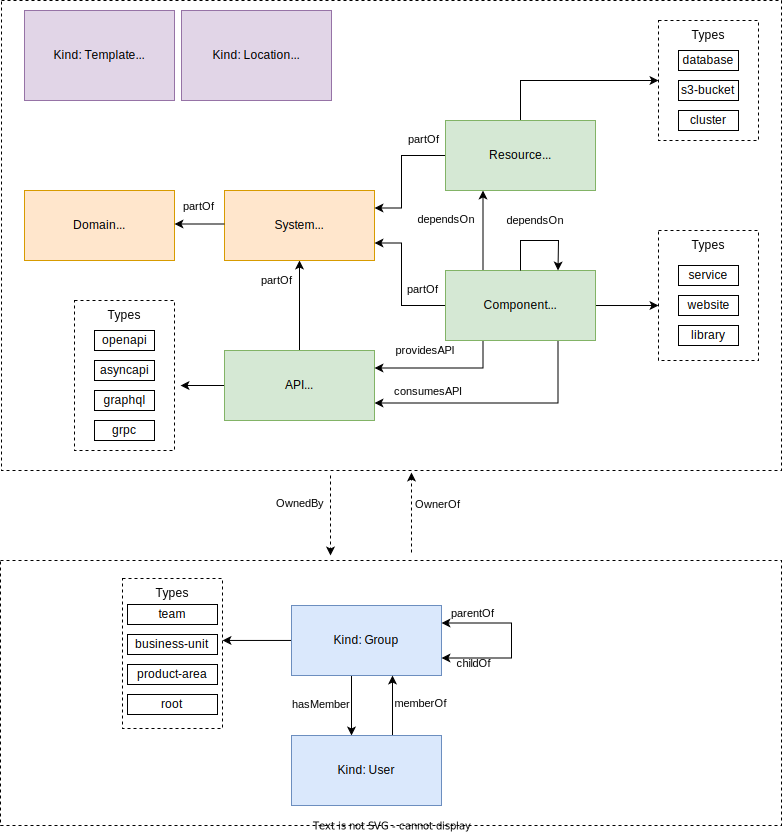
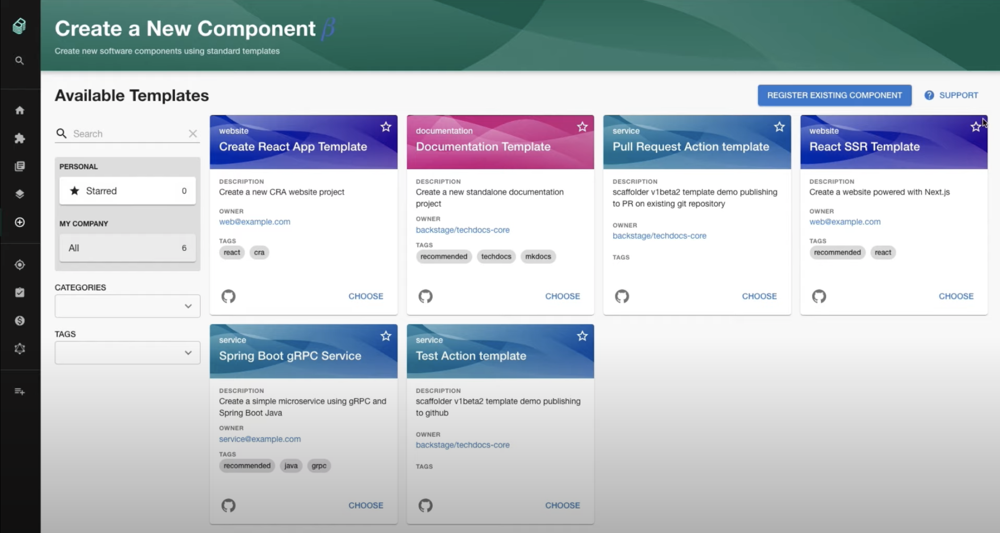
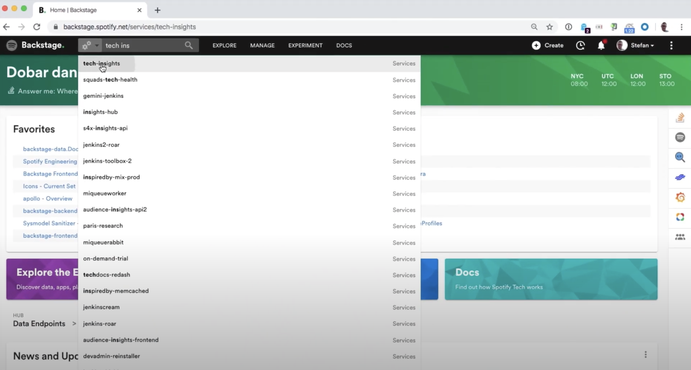
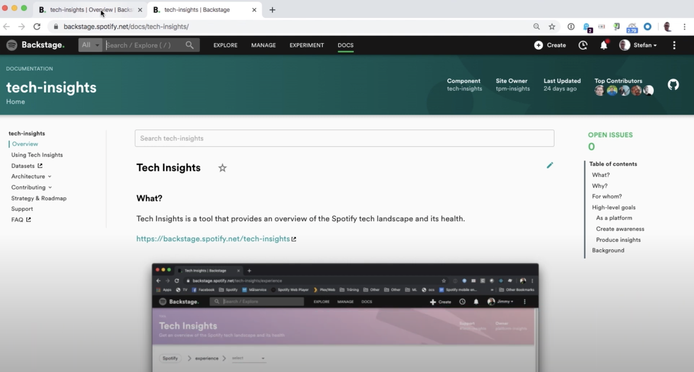

Documentation is crucial to ensure smooth operation and growth of any team or organization. While starting with documentation in a tool like `Notion` is a great first step, it can be challenging to keep track of documents and ensure they are up-to-date as our team and organization grows. This often leads to common questions such as "Is this document still relevant?" or "Who is responsible for maintaining this document?" being asked repeatedly.

In order for documentation to be scalable, we should be able to

- trust the information we find
- discover what we need easily
- provide feedback or make changes to a document and get reviews by the owner
- find out who's the owner for direct consultation
- know whether the documentation we create is used and useful
- retrieve different versions of the document
- start documentation quickly
- change the documentation along with the corresponding code

To meet these requirements, the tool we choose should

- have landing pages for easy navigation
- have internal policies, templates, or rules to be followed for consistency
- be placed under source control to manage different versions of documentation and ensure changes are tracked like bugs in code
- have clear ownership established to ensure accountability and maintenance of the documents
- have regular reviews for changes and periodic evaluations to ensure the documentation remains relevant and accurate

## Treat Documentation like Code

One solution to these issues is to treat documentation like code. Google has its internal management tool "g3doc" that locates the documentation next to the source code, but it's not available to the public. However, Spotify has open-sourced its internal tool, **Backstage**.

> Powered by a centralized software catalog, Backstage restores order to your infrastructure and enables your product teams to ship high-quality code quickly — without compromising autonomy.

## Backstage - Software Catalog

[Backstage Software Catalog](https://backstage.io/docs/features/software-catalog/) is a centralized system that helps you keep track of all the software in your ecosystem, including services, websites, libraries, data pipelines, and more. It enables you to manage ownership and metadata of your software by using metadata YAML files that are stored with the code and visualized in Backstage.

Using Software Catalog, you can benefit from features like ownership, discoverability, and relations. The home page of Software Catalog enables you to manage and maintain the software you own while making all the software in your company discoverable, so no software goes unnoticed in dark corners of your ecosystem.

Here is an example landing page:

Additionally, Software Catalog helps you maintain an ecosystem modeling diagram that depicts the relationships between different entities.

## Backstage - Software Templates

[Backstage Software Templates](https://backstage.io/docs/features/software-templates/) part of Backstage is a tool that can help you create Components inside Backstage. By default, it has the ability to load skeletons of code, template in some variables, and then publish the template to some locations like GitHub or GitLab.

It's super powerful. You can create "Create React App Template", "Documentation Template", "Pull Request Action Template", ... for your team.

## Backstage - Search

[Backstage Search](https://backstage.io/docs/features/search/) lets you find the right information you are looking for in the Backstage ecosystem. Backstage supports 3 search engines by default, an in-memory engine called Lunr, [Elasticsearch](https://backstage.io/docs/reference/plugin-search-backend-module-elasticsearch/) and [Postgres](https://backstage.io/docs/reference/plugin-search-backend-module-pg/).

## Backstage - TechDocs

[Backstage TechDocs](https://backstage.io/docs/features/techdocs/) is Spotify’s homegrown docs-like-code solution built directly into Backstage. Engineers write their documentation in Markdown files which live together with their code - and with little configuration get a nice-looking doc site in Backstage.

There is even a **ReportIssue** Addon, helping you to create a feedback loop that drives up documentation quality and foster a documentation culture at your organization.

## Conclusion

In conclusion, Backstage provides a comprehensive solution for scaling documentation in growing teams. By leveraging Backstage's various features, we can address different requirements of our documentation needs.

We can create landing pages and manage ownership of our software with Backstage Software Catalog. Backstage Templates allow us to use internal templates to create and maintain consistent documentation. Backstage TechDocs helps us put our documentation under source control and track issues and review changes. Finally, Backstage's powerful search functionality enables us to quickly search for anything we need.

With Backstage, we can ensure that our documentation stays organized, up-to-date, and accessible to everyone on the team. Whether it's landing pages, templates, source control, or search, Backstage has got us covered 💪

## References

- [Backstage.io](https://backstage.io/)
- [How Spotify Adopted and Outsourced Its Platform Mindset](https://thenewstack.io/how-spotlify-adopted-platform-engineering-culture/)
- [How we are solving internal technical documentation at Spotify -- Gary Niemen](https://www.youtube.com/watch?v=uFGCaZmA6d4)
- [Let's Treat Docs Like Code](https://www.docslikecode.com/)
- [Backstage - Behind the bar](https://www.frontendhappyhour.com/episodes/backstage-behind-the-bar/)
- [Software Engineering at Google](https://www.amazon.com/Software-Engineering-Google-Lessons-Programming/dp/1492082791)
